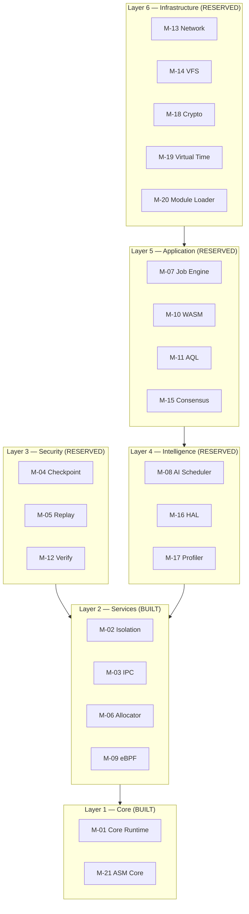
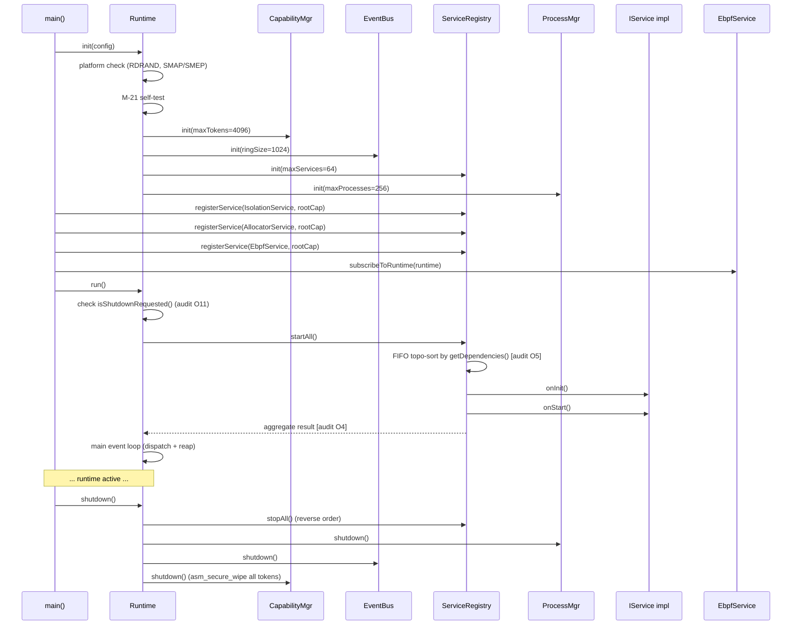
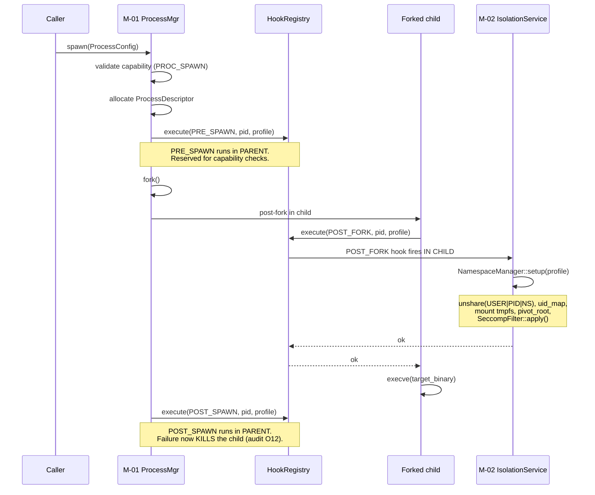
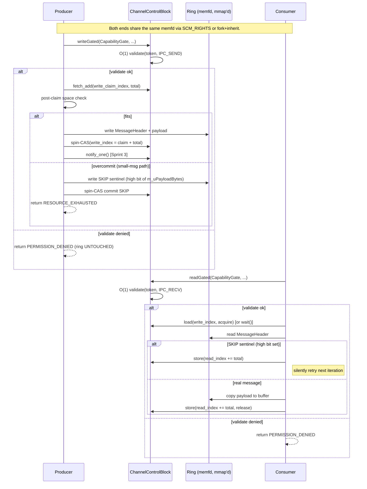
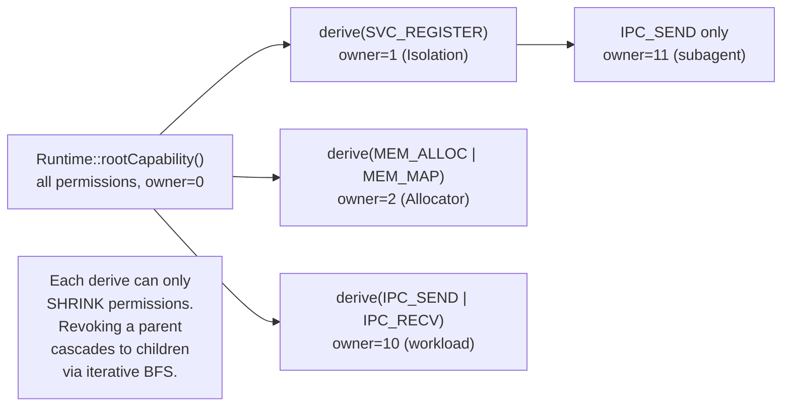
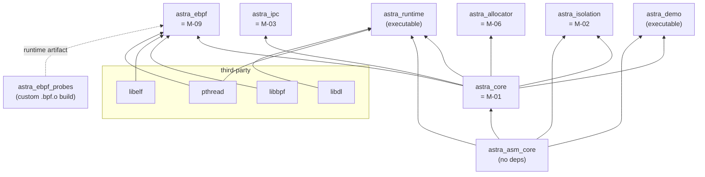

# Astra Runtime — The Bible

> Complete onboarding + reference document. If you are new to the project,
> read this top-to-bottom; it assumes nothing.
>
> Last updated: 2026-06-05, against `origin/main` at `5e0e7fa`.

---

## Table of contents

0. [TL;DR — what to read first](#0-tldr--what-to-read-first)
1. [What Astra is](#1-what-astra-is)
2. [Why this project exists](#2-why-this-project-exists)
3. [The 6-layer architecture](#3-the-6-layer-architecture)
4. [The 21-module catalog](#4-the-21-module-catalog)
5. [Module deep dives — what's actually built](#5-module-deep-dives--whats-actually-built)
6. [Runtime composition — how modules talk](#6-runtime-composition--how-modules-talk)
7. [Capability model](#7-capability-model)
8. [Build system](#8-build-system)
9. [Test inventory](#9-test-inventory)
10. [Paper 1 — the research artifact](#10-paper-1--the-research-artifact)
11. [Coding conventions](#11-coding-conventions)
12. [Where things live (file tree)](#12-where-things-live-file-tree)
13. [History — how we got here](#13-history--how-we-got-here)
14. [Audit findings & open issues](#14-audit-findings--open-issues)
15. [Onboarding playbook](#15-onboarding-playbook-day-1--first-pr)
16. [FAQ](#16-faq)

---

## 0. TL;DR — what to read first

If you have 5 minutes:
- Read §1 (what Astra is) and §2 (why it exists).
- Then run `./scripts/compile-astra.sh deps && ./scripts/compile-astra.sh` on a Fedora x86_64 box.

If you have an hour:
- Read §1–§7 in order. By the end you'll know what every module does and
  how they wire together.

If you're picking up actual work:
- §10 (Paper 1) tells you what the research deliverable is.
- §14 (audit findings) tells you what bugs are known.
- §15 (onboarding playbook) tells you how to make your first PR.

If you just want to find something:
- §12 (file tree) is the authoritative map.

---

## 1. What Astra is

**Astra Runtime** is a *userspace kernel* — a supervisor that runs above
Linux and orchestrates sandboxed processes without modifying the host
kernel. It is written in C++23 with hand-written x86-64 NASM for the
hot crypto and timing primitives.

The defensible technical claim, narrow and falsifiable:

> Astra Runtime is the first userspace runtime to enforce
> **capability-token-mediated access control on a zero-copy IPC fastpath
> on stock Linux**, without kernel modification, special hardware
> (CHERI / Morello), or hypervisor support. The capability check costs
> less than X ns per message at p99, keeping IPC latency within Y % of
> Aeron's published 250 ns RTT floor while supporting
> Cornucopia-Reloaded-class O(1) cascading revocation in software.

That is the Paper 1 (USENIX ATC 2027) thesis. Everything in this codebase
ultimately serves it.

**Languages**: C++23 + x86-64 NASM.
**Target**: Linux x86_64 only. The build refuses every other host
(`CMakeLists.txt:24`).
**Status**: pre-alpha. Six of twenty-one modules are real; the rest are
reserved scaffolding.

---

## 2. Why this project exists

The capability-mediated-IPC research space has three known points:

| System | Capability layer? | IPC fastpath? | Linux-compatible? | Hardware needed? |
|---|---|---|---|---|
| seL4 | ✅ formal capabilities | ✅ fast IPC | ❌ own microkernel | none |
| CAP-VMs (OSDI '22) | ✅ | ✅ | ❌ needs CHERI | CHERI/Morello |
| HongMeng (OSDI '24) | partial | ✅ | partial (below kernel) | none |
| LITESHIELD (ATC '25) | ❌ | ✅ shm | ✅ above Linux | none |
| **Astra** | **✅** | **✅** | **✅ above Linux** | **none** |

The empty cell — "capability-mediated IPC, above the kernel on stock
Linux, no special hardware" — is the publication opening. Astra
exists to fill it.

The full publication strategy is in
[docs/PUBLICATION_STRATEGY.md](PUBLICATION_STRATEGY.md). Paper 1 is the
foundation; Papers 2–5 (hardware-tagged capabilities, LLM agent
sandboxing, attestation, post-quantum hybrid crypto) cite Paper 1.

---

## 3. The 6-layer architecture

Each layer is a security boundary. A breach must clear all six to
compromise a sandboxed task.



**Why M-21 sits in Layer 1**: every higher layer depends on the
constant-time crypto and memory primitives in M-21 being correct. If
those primitives leak timing info, the whole stack is compromised.

**Why Layer 3 (Security) is its own layer**: C++ has no compile-time
memory safety. The Security layer compensates with intrusion detection,
CFI enforcement, and cryptographic integrity checks on every cross-
module call — the differentiator vs. a Rust-based equivalent.

---

## 4. The 21-module catalog

As of 2026-06-05, current state:

| Layer | Module | Status | Sprint |
|---|---|---|---|
| 1 | **M-01 Core Runtime** | **BUILT** | Phase 2 + Paper-1 Sprint 4 (O(1) validate) |
| 1 | **M-21 ASM Core** | **BUILT** | 7 NASM primitives shipped |
| 2 | **M-02 Isolation** | **BUILT** | Sprint 3 (USER+PID+MOUNT namespaces, pivot_root, seccomp) |
| 2 | **M-03 IPC** | **BUILT** | Sprint 5 (channel factory, ring buffer, futex wait/notify, capability gate) |
| 2 | **M-06 Allocator** | **BUILT** | Sprint 3 (pools, hardening, capability-gated, audit) |
| 2 | **M-09 eBPF** | **BUILT** | Sprint 1 (probe loader, ring buffer poller, EventBus subscription) |
| 3 | M-04 Checkpoint | STUB | empty dir |
| 3 | M-05 Replay | STUB | empty dir |
| 3 | M-12 Verify | partial | CBMC monotonicity proof landed |
| 4 | M-08 AI Scheduler | STUB | empty dir |
| 4 | M-16 HAL | STUB | empty dir |
| 4 | M-17 Profiler | STUB | empty dir |
| 5 | M-07 Job Engine | STUB | empty dir |
| 5 | M-10 WASM | STUB | empty dir |
| 5 | M-11 AQL | STUB | empty dir |
| 5 | M-15 Consensus | STUB | empty dir |
| 6 | M-13 Network | STUB | empty dir |
| 6 | M-14 VFS | STUB | empty dir |
| 6 | M-18 Crypto | STUB | empty dir |
| 6 | M-19 Virtual Time | STUB | empty dir |
| 6 | M-20 Module Loader | STUB | empty dir |

**Six modules are real.** Fifteen are reserved scaffolding (a directory
under `src/` and `include/astra/`, plus a `ModuleId` slot in the enum,
so the identifier space is stable while the implementations land).

---

## 5. Module deep dives — what's actually built

### M-01 Core Runtime (`astra::core`)

**Lives in**: [src/core/](../src/core/), [include/astra/core/](../include/astra/core/).

The central nervous system. Owns capability tokens, service registry,
event bus, process manager, hook registry.

**Public types**:

- `Runtime` — orchestrator. Owns everything else. Public API in
  [runtime.h](../include/astra/core/runtime.h).
- `CapabilityManager` — token pool of 4096 slots. Tokens are
  unforgeable 128-bit IDs carrying a `Permission` bitmask, epoch, and
  owner id. The **O(1) slot-indexed `validate()`** is the Paper-1
  critical path: slot index is packed into the high 32 bits of
  `m_arrUId[0]`; the remaining 96 bits are RDRAND-filled and verified
  by `asm_ct_compare`.
- `IService` — the interface every module implements. Lifecycle:
  `onInit() → onStart() → onStop()`. Plus `name()`, `moduleId()`,
  `isHealthy()`, `getDependencies()`.
- `ServiceRegistry` — pre-allocated table of up to 64 service slots,
  O(1) lookup by id. **FIFO topological sort** for `startAll()`.
  Returns aggregate failure status (audit fix O4).
- `EventBus` — lock-free ring buffer of 1024 × 64-byte events. Up to
  64 subscribers. *Known: multi-producer race is documented but not
  fixed — see audit O3.*
- `ProcessManager` — 256-slot process descriptor table, real fork/exec
  spawning, signal reaping, restart policy. Owns the `HookRegistry`.
- `HookRegistry` — priority-ordered chains keyed on `HookPoint::
  {PRE_SPAWN, POST_FORK, POST_SPAWN, PRE_KILL, POST_EXIT}`. Each chain
  holds up to 16 hooks. M-02 registers a `POST_FORK` hook (audit fix
  O1 — was previously the legacy `setIsolationHook` slot which ran in
  the wrong process).

**Capability ABI**:
```cpp
auto root = mgr.create(Permission::SYS_ADMIN | Permission::SVC_REGISTER,
                       /*owner=*/1).value();
auto child = mgr.derive(root, Permission::IPC_SEND, /*owner=*/2).value();
bool ok = mgr.validate(child, Permission::IPC_SEND);  // O(1)
auto n = mgr.revoke(root).value();   // cascades to all descendants
```

`validate()` is wait-free; create / derive / revoke take a spinlock.
TokenSlot fields (`m_bActive`, `m_uRevokedAtEpoch`) are `std::atomic`
with release/acquire ordering (audit fix C1 — the original plain-type
fields had a data race that broke the "no stale validate" property on
ARM64).

**Tests**:
- `Phase2UnitTest`, `Phase2IntegrationTest` — runtime + process spawn
- `CapabilityUnitTest` — 8 adversarial cases (forged slot, OOB slot,
  future epoch, bit-flipped UID, etc.)
- `CapabilityConcurrencyTest` — 8 threads × 4s mixed ops
- `CapabilitySurvivabilityTest` — reaper + 6 producers, no stale validate
- `CapabilityPropertyTest` — 50k random ops × 5 seeds vs. pure-C++ oracle

### M-21 ASM Core (`astra::asm_core`)

**Lives in**: [src/asm_core/](../src/asm_core/), [include/astra/asm_core/](../include/astra/asm_core/).

Hand-written x86-64 NASM for the seven security-critical primitives:

| Primitive | Purpose |
|---|---|
| `asm_secure_wipe(ptr, len)` | non-elidable memset-to-zero, MFENCE'd |
| `asm_ct_compare(a, b, len)` | constant-time memcmp; data-independent timing |
| `asm_ct_select(cond, a, b)` | constant-time conditional select (no branch) |
| `asm_rdrand64(*out)` | hardware RNG, 10-retry budget |
| `asm_lfence()` | speculation barrier |
| `asm_cache_flush_range(ptr, len)` | `clflushopt` for cold-line testing |
| `asm_stack_canary_init()` | RDRAND-based per-thread canary, fails closed on RDRAND exhaustion (returns 0; audit fix C8) |

All seven `.asm` files live in [src/asm_core/asm/](../src/asm_core/asm/).
The C++ stub layer in [asm_core_stubs.cpp](../src/asm_core/asm_core_stubs.cpp)
declares them `extern "C"` and provides a self-test that verifies
correctness at runtime startup.

**ABI**: SysV AMD64. Args in rdi/rsi/rdx/rcx; return in rax/eax.
Stack alignment preserved at call boundaries. No CPU feature flags
pollute the NASM build (audit fix — the `-mrdrnd` etc. flags are now
gated to C/CXX only via per-flag `$<COMPILE_LANGUAGE:C,CXX>` genex).

**Tests**: `AsmCoreNasmPorts` — verifies each primitive's contract.

### M-02 Isolation (`astra::isolation`)

**Lives in**: [src/isolation/](../src/isolation/), [include/astra/isolation/](../include/astra/isolation/).

Linux namespace + filesystem + seccomp sandboxing.

- `IsolationService : IService` — registers a **POST_FORK** hook into
  M-01's `ProcessManager` so namespace + seccomp setup runs IN THE
  CHILD after fork (audit fix O1 — was incorrectly running in the
  parent before).
- `NamespaceManager` — per-process namespace lifecycle. State machine:
  `INIT → USER_CREATED → MAPPED → PID_CREATED → MOUNT_CREATED →
  FS_PIVOTED → ACTIVE`. Each transition is atomic; `rollback()`
  unwinds whatever step failed (with the documented caveat that
  pivot_root is irreversible).
- `ProfileEngine` — five sandbox profiles (PARANOID, STRICT, STANDARD,
  RELAXED, CUSTOM), each with a `NamespaceFlags` and a `SeccompMode`.
- `SeccompFilter` — builds a BPF program for the PARANOID syscall
  allowlist and installs via `prctl(PR_SET_NO_NEW_PRIVS) +
  prctl(PR_SET_SECCOMP)`. Allowlist is now ~40 syscalls (initial
  17 expanded after Sprint 3 audit; see commit `d902500`).

**PARANOID allowlist** (current set, see
[seccomp_filter.cpp](../src/isolation/seccomp_filter.cpp)):

- I/O: read, write, close, readv, writev, pread64, pwrite64, openat,
  lseek, dup, dup3, ioctl
- Memory: mmap, munmap, mremap, mprotect, madvise, brk
- File metadata: fstat, newfstatat, statx, getdents64, unlink, unlinkat
- Process identity: getpid, gettid, getppid, getuid, geteuid, getgid,
  getegid
- Signals: rt_sigaction, rt_sigprocmask, rt_sigreturn, sigaltstack
- Lifecycle: clone, clone3, wait4, exit, exit_group, execve, execveat,
  futex
- Runtime: arch_prctl, set_tid_address, set_robust_list, prlimit64,
  getrandom, rseq, prctl
- Time: clock_gettime, clock_nanosleep, nanosleep, gettimeofday

Still blocked: all network (socket / connect / bind / listen / accept),
ptrace, kexec, init_module, unshare, setns, mount, umount2, bpf,
perf_event_open.

**Tests**:
- `Sprint1NamespaceTest` — USER + PID namespace, getpid()==1, uid==0
  inside namespace
- `Sprint2MountTest` — MOUNT namespace, tmpfs sandbox at `/tmp/astra_sandbox/<pid>`,
  RO bind mounts of `/usr/lib` and `/usr/share`, pivot_root with
  `MS_PRIVATE` propagation (commit `52b1c16` is what makes pivot_root
  work on systemd hosts)
- `Sprint3SeccompTest` — read allowed, socket killed by SIGSYS,
  unshare killed by SIGSYS

### M-03 IPC (`astra::ipc`)

**Lives in**: [src/ipc/](../src/ipc/), [include/astra/ipc/](../include/astra/ipc/).

Zero-copy interprocess communication on stock Linux.

- `Channel`, `UniqueFd`, `ChannelFactory` — `memfd_create` +
  `mmap(MAP_SHARED)` to create a process-shareable region. Each
  channel carries a 3-cache-line `ChannelControlBlock` (write index,
  read index, metadata) followed by a power-of-two ring buffer
  (default 2 MiB).
- `RingBuffer` — framed messages with an 8-byte `MessageHeader`.
  Two-phase MPSC claim/commit:
  - ≤ 256 B payloads: wait-free single `fetch_add` on
    `m_uWriteClaimIndex`.
  - > 256 B payloads: lock-free CAS retry loop.
  - Overcommit on the small-message path leaves a SKIP sentinel that
    `read()` silently consumes. **SKIP encoding** (audit C10): the
    high bit of `m_uPayloadBytes` flags SKIP, not a magic sequence
    number — the old encoding collided after 4 billion writes.
- `writeNotify()` / `readWait()` — `std::atomic::wait()` /
  `notify_one()`, futex-backed.
- **`CapabilityGate`** (Sprint 5) — POD `{CapabilityManager*,
  CapabilityToken}`. The gated overloads `writeGated()` / `readGated()`
  / `writeNotifyGated()` / `readWaitGated()` validate the token via
  M-01's O(1) `validate()` BEFORE touching the ring. On
  PERMISSION_DENIED the ring is **untouched** — no claim, no commit,
  no contention with honest producers. **TOCTOU semantics**: the gate
  is "best-effort revocation" (audit C7); in-flight messages may land
  after a revoke, but no new message after revoke completes will.

**Tests**: 7 ctest binaries cover channel factory, ring framing, MPSC
contention, futex wait/notify, capability gate (basic + concurrency).

### M-06 Allocator (`astra::allocator`)

**Lives in**: [src/allocator/](../src/allocator/), [include/astra/allocator/](../include/astra/allocator/).

Pool-based, hardened memory manager.

- `MemoryManager` — 4-tier pool routing (tiny / small / medium / large)
- `PoolAllocator` — slab-style fixed-size pools
- `QuotaManager` — per-`ModuleId` byte and object quotas
- `AllocAuditor` — emits `AuditEvent` records (`ALLOC`, `FREE`,
  `CAPABILITY_REJECT`, `QUOTA_REJECT`, `DOUBLE_FREE`, `CORRUPTION`)
- `AllocatorService : IService` — public API
  `allocateFor(ModuleId, size, CapabilityToken&)` validates the
  `MEM_ALLOC` permission, then the quota, then routes to a pool.

**Hardening**: poison patterns at allocation/free boundaries,
double-free detection via slot-state machine, canary corruption
detection via M-21's `asm_secure_wipe`/`asm_ct_compare`.

**Tests**: `AllocatorSprint1/2/3` — pool routing, hardening, quota +
capability gate.

### M-09 eBPF (`astra::ebpf`)

**Lives in**: [src/ebpf/](../src/ebpf/), [include/astra/ebpf/](../include/astra/ebpf/).

Kernel-side telemetry via libbpf + USDT probes, plus a userspace
EventBus subscription for non-USDT events.

- `EbpfService : IService` — `name() = "ebpf-observability"`,
  `moduleId() = ModuleId::EBPF`. Optional
  `subscribeToRuntime(Runtime&)` wires up the EventBus subscription
  (audit fix O8 — previously there was no userspace event source).
- `ProbeManager` — scans a probe directory at startup and loads every
  `.bpf.o` it finds via libbpf's `bpf_object__open`/`bpf_object__load`.
- `RingBufferPoller` — runs an `epoll_wait`-driven thread that drains
  the kernel ring buffer (`BPF_MAP_TYPE_RINGBUF`, 256 KiB) and calls a
  user callback for each event.
- `task_spawn.bpf.c` — the one shipped USDT probe.

**Tests**: `EbpfUnitTests` — layout, lifecycle guards, probe-dir
validation (struct-layout only, no kernel probe attachment).

---

## 6. Runtime composition — how modules talk

Cross-module communication uses three mechanisms, in order of preference:

1. **Direct accessor on `Runtime`** for "give me the singleton manager".
   Example: `runtime.capabilities().validate(token, Permission::IPC_SEND)`.
2. **Hook chains** for lifecycle interception. Example: M-02 registering
   a `POST_FORK` hook to enable namespaces + seccomp in the child.
3. **`EventBus::publish`** + `subscribe` for decoupled fan-out. Example:
   M-09 subscribing via `subscribeToRuntime(runtime)`.

The cardinal rule: **never call across modules through anything else.**
No file-scoped globals, no friend classes across module boundaries, no
exceptions thrown across module boundaries.

### Boot sequence



### Process spawn — the M-01 ↔ M-02 hot path

This is the single most important integration. It shows how the
isolation hook is called *inside the forked child*, not in the parent
(the audit O1 fix).



### IPC data flow — the M-03 ring buffer



---

## 7. Capability model

Permissions monotonically shrink down the derivation tree. Revoking
any token revokes all its descendants — implemented by bumping the
global epoch and cascading via iterative BFS (audit C3 — was
recursive, blow-the-stack-able).



**The slot-indexed validate trick** (Paper-1 Sprint 4):

```
m_arrUId[0]  =  [ pool_slot_idx (32 bits) | random (32 bits) ]
m_arrUId[1]  =  [ random (64 bits) ]
                  ^
                  total: 96 bits of randomness, 2^96 forgery resistance
```

`validate()` extracts the slot in one shift, indexes the pool once,
then `asm_ct_compare`s the full 128-bit UID. O(1) regardless of pool
occupancy. The slot index is a hint, not a credential — forging it
just lands the lookup at a real slot, where ct_compare still has to
match the 96 random bits.

**RDRAND failure handling** (audit C2): if RDRAND fails, `create()` and
`derive()` return an error rather than emitting a predictable token.
The previous fallback (`m_uCurrentEpoch ^ magic`) collapsed forgery
resistance to ~0 in VMs without VirtIO-RNG.

---

## 8. Build system

Astra ships a single-entry build driver: **[scripts/compile-astra.sh](../scripts/compile-astra.sh)**.

### Quick start

```bash
git clone https://github.com/KernelArch-Lab/Astra.git
cd Astra
./scripts/compile-astra.sh deps          # sudo dnf install all prerequisites
./scripts/compile-astra.sh check         # verify toolchain + RDRAND + headers
./scripts/compile-astra.sh sysctl        # sudo sysctl -w userns + perf
./scripts/compile-astra.sh               # configure + build + ctest
```

Or single-shot end-to-end:

```bash
./scripts/compile-astra.sh all           # deps + check + sysctl + build + cbmc + sweep + paper
```

### Sub-commands

| Command | What it does |
|---|---|
| (default) | configure + build + ctest |
| `deps` | dnf install all Fedora prerequisites |
| `check` | pre-flight checks (g++ ≥ 13, cmake ≥ 3.28, RDRAND, headers, sysctls) |
| `sysctl` | enable userns + perf_event_paranoid sysctls, persist to /etc/sysctl.d/99-astra.conf |
| `build` | same as default |
| `cbmc` | run formal/cbmc monotonicity proof (37 checks) |
| `sweep` | run Paper-1 benchmark sweep → artefact/*.csv |
| `paper` | build Paper-1 PDF (with --refresh if CSVs exist) |
| `clean` | rm -rf build/ artefact/ paper-pdf-artifacts |
| `all` | every step above in order |

### Build types

```bash
ASTRA_BUILD_TYPE=Release  ./scripts/compile-astra.sh
ASTRA_BUILD_TYPE=Sanitize ./scripts/compile-astra.sh    # ASan + UBSan
ASTRA_BUILD_TYPE=Tsan     ./scripts/compile-astra.sh    # ThreadSanitizer
```

Or shorthand flags: `--release`, `--sanitize`, `--tsan`.

### Build dependency graph



The graph is a strict DAG. Build order falls out of CMake from
`target_link_libraries`. Compile flags are gated to C/CXX only — NASM
TUs see only their `elf64` output format setting, NOT the global
`-fstack-protector-strong`, `-fPIE`, `-mrdrnd` etc. (audit fixes
`ab62f52`, `6e1778b`).

### Adding a module to the build

Concrete checklist for moving a module from STUB to BUILT:

1. Create `include/astra/<module>/<service>.h` declaring the
   `IService` subclass.
2. Create `src/<module>/<service>.cpp` with the implementation.
3. Create `src/<module>/CMakeLists.txt`:

   ```cmake
   add_library(astra_<module> STATIC <service>.cpp)
   target_include_directories(astra_<module>
       PUBLIC ${CMAKE_SOURCE_DIR}/include)
   target_link_libraries(astra_<module>
       PUBLIC astra_core
       PRIVATE pthread)
   message(STATUS "  [M-XX] astra_<module> library configured")
   ```

4. Uncomment the corresponding `add_subdirectory(src/<module>)` line in
   the root `CMakeLists.txt`.
5. Create `tests/<module>/CMakeLists.txt` with at least one
   `add_executable` + `add_test` registration.
6. Uncomment `add_subdirectory(tests/<module>)` in the root.

M-02, M-03, M-06 and M-09 follow this exact shape — copy any of them.

---

## 9. Test inventory

Every test currently registered with CTest (21 gates):

| ID | Module | Executable | What it verifies |
|---|---|---|---|
| 1 | M-02 | `test_sprint1` | USER + PID NS, deny-setgroups, uid_map |
| 2 | M-02 | `test_sprint2` | MOUNT NS + tmpfs sandbox + RO bind + pivot_root |
| 3 | M-02 | `test_sprint3_seccomp` | PARANOID allowlist: read allowed, socket/unshare killed by SIGSYS |
| 4 | M-01 | `test_phase2_unit` | HookRegistry, dependency graph, descriptor lifecycle |
| 5 | M-01 | `test_capability` | 8 adversarial cases (forged slot, OOB, future epoch...) |
| 6 | M-01 | `test_capability_concurrency` | 8 threads × 4s mixed ops, no-stale-validate |
| 7 | M-01 | `test_capability_survivability` | reaper + 6 producers, after-revoke invariant |
| 8 | M-01 | `test_capability_property` | 50k random ops × 5 seeds vs. pure-C++ oracle |
| 9 | M-01 | `test_phase2_integration` | real fork/exec + signal delivery + reaping |
| 10 | M-06 | `test_allocator` | pool routing, basic alloc/free |
| 11 | M-06 | `test_allocator_sprint2` | poison, double-free, canary corruption |
| 12 | M-06 | `test_allocator_sprint3` | quota, capability gate, audit emission |
| 13 | M-03 | `test_ipc_sprint1` | memfd + mmap channel allocation |
| 14 | M-03 | `test_ipc_sprint1_extended` | SCM_RIGHTS handoff with Astra payloads |
| 15 | M-03 | `test_ipc_sprint2` | ring framing, FIFO ordering, wraparound |
| 16 | M-03 | `test_ipc_sprint2_mpsc` | wait-free / CAS paths, SKIP sentinel |
| 17 | M-03 | `test_ipc_sprint3` | futex wait/notify |
| 18 | M-03 | `test_ipc_sprint5_cap_gate` | gate ON, denial leaves ring untouched |
| 19 | M-03 | `test_ipc_sprint5_gate_concurrency` | revoke mid-flight, no post-deny publish |
| 20 | M-09 | `test_ebpf` | EbpfEventHeader layout, lifecycle, probe-dir validation |
| 21 | M-21 | `test_asm_core` | each NASM primitive's contract |

**Not ctest gates** (built but run on demand):
- `bench_capability_validate` (M-01) — Paper-1 Figure 2 source
- `bench_ipc_latency` (M-03) — Paper-1 latency benchmark
- `bench_ipc_with_gate` (M-03) — gate-ON vs gate-OFF microbench
- `tests/bench/baseline_*` — pipe, socketpair, io_uring, Aeron, eRPC,
  astra raw, astra gated (Paper-1 baselines)
- `bench_throughput`, `bench_throughput_mpsc`, `bench_pool_scaling`,
  `bench_revocation_latency`, `bench_perfcounters` (Paper-1 metrics)
- `fuzz_gate_target` — libFuzzer entry (built only with `ASTRA_FUZZ_BUILD`)

---

## 10. Paper 1 — the research artifact

The deliverable for year 1 (April 2026 → April 2027) is **a USENIX ATC
2027 submission**. The thesis is fixed (see §1). The artifact is the
codebase plus a one-command reproducibility harness.

### The 10-sprint Paper-1 track

| Sprint | What it added | Files |
|---|---|---|
| **4** | M-01 O(1) slot-indexed validate | `src/core/capability.cpp`, `tests/core/unit/test_capability.cpp` |
| **5** | M-03 capability-gated IPC fastpath | `src/ipc/RingBuffer.cpp`, `tests/ipc/test_sprint5_*.cpp` |
| **6** | Baseline harnesses (pipe / socketpair / io_uring / Aeron / eRPC / Astra) | `tests/bench/baseline_*.cpp` |
| **7** | Sweep + Figure-1 plotter + outline + AE reproducibility doc | `scripts/run_paper1_sweep.sh`, `scripts/plot_paper1_figure.py`, `papers/paper1/outline.md` |
| **8** | Throughput / MPSC / revocation / perf-counter / pool-scaling benches | `tests/bench/bench_*.cpp` |
| **9** | Concurrency / survivability / property / fuzz tests | `tests/core/unit/test_capability_*.cpp`, `tests/ipc/fuzz/fuzz_gate_target.cpp` |
| **10** | LaTeX draft, bibliography, build pipeline | `papers/paper1/*.tex`, `papers/paper1/build.sh` |
| (parallel) | M-21 NASM ports + CBMC monotonicity proof + RDTSC bench | `src/asm_core/asm/*.asm`, `formal/cbmc/capability_monotonicity.c`, `tests/ipc/bench_latency.cpp` |

All ten sprints landed in main between commits `635b86d` (Sprint 4) and
`5e0e7fa` (last audit fix). The trail is visible in the commit history.

### Paper structure (`papers/paper1/`)

```
papers/paper1/
├── main.tex                 # USENIX two-column root
├── macros.tex               # \sysname, \validateP99 etc. — placeholders
│                            # filled by gen_numbers_tex.py
├── bibliography.bib         # 36 entries
├── build.sh                 # pdflatex×2 + bibtex driver
├── README.md                # build flow + file layout
├── outline.md               # section-by-section plan
├── sections/                # 9 .tex files (00_abstract → 09_conclusion)
├── figures/                 # Makefile + gate_path.tex (TikZ)
├── numbers/                 # numbers.tex + table_1.tex + table_perf.tex
└── submission/              # anonymize.sh, cover_letter.md, author_response_template.md
```

### Numbers flow

```
benchmarks (C++) ───run_paper1_sweep.sh───▶ artefact/*.csv
                                                 │
        ┌────────────────────────────────────────┼───────────────────┐
        ▼                                        ▼                   ▼
plot_paper1_figure_*.py                 gen_numbers_tex.py    gen_table_perf.py
        │                                        │                   │
        ▼                                        ▼                   ▼
figures/*.pdf                       numbers/numbers.tex     numbers/table_perf.tex
        │                                        │                   │
        └──────────┬─────────────────────────────┴───────────────────┘
                   ▼
             pdflatex main.tex
                   │
                   ▼
               main.pdf
```

### Reproducing the paper

```bash
./scripts/check_paper1_env.sh         # verify pdflatex + matplotlib + perf
sudo ./scripts/run_paper1_sweep.sh    # ~10 min, fills artefact/*.csv
papers/paper1/build.sh --refresh      # regen figures + numbers, pdflatex×2
# → papers/paper1/main.pdf
```

Without `--refresh`, `build.sh` produces a structurally-complete PDF
with red `[placeholder]` markers — useful for iterating on prose
without re-running benchmarks. Stub PDFs are auto-generated for any
missing figures.

### CBMC monotonicity proof

The paper cites a CBMC bounded-model-check proof of capability
monotonicity. The proof lives in
[formal/cbmc/capability_monotonicity.c](../formal/cbmc/capability_monotonicity.c)
and runs via:

```bash
./scripts/compile-astra.sh cbmc      # or: make -C formal/cbmc verify
```

Expected output: `0 of 37 failed`, `VERIFICATION SUCCESSFUL`.

---

## 11. Coding conventions

### Naming (Hungarian-style)

| Scope | Prefix | Example |
|---|---|---|
| Member field | `m_` | `m_iFd`, `m_eState`, `m_szName` |
| Local variable | `l` | `lIRetVal`, `lSzPath` |
| Function argument | `a` | `aProfile`, `aUHostUid`, `aSzName` |
| Global | `g_` | `g_logIpc` |

| Type | Letter | Example |
|---|---|---|
| `int` | `i` | `m_iFd` |
| `U32` / `U64` / `SizeT` | `u` | `m_uWriteIndex` |
| `bool` | `b` | `m_bInitialised` |
| enum | `e` | `m_eState` |
| pointer | `p` | `m_pControl` |
| `std::string` / `const char*` | `sz` | `m_szName` |
| `std::vector` | `v` | `m_vThreads` |
| file descriptor | `fd` | `m_fdUserNs` |
| `std::atomic` | (none — show via type) | `std::atomic<U64> m_uActiveCount` |

### Namespaces

| Symbol | Lives in |
|---|---|
| `U8`, `U32`, `U64`, `Status`, `Result<T>`, `ModuleId`, `ProcessId`, `Permission` enum (the **enum class** itself uses `Permission::IPC_SEND` style) | `astra::` |
| `CapabilityToken`, `CapabilityManager`, `Permission` (enum class definition), `IService`, `ServiceRegistry`, `Runtime`, `EventBus`, `Event`, `EventType`, `ProcessManager`, `HookEntry`, `HookPoint`, `HookRegistry`, `IsolationProfile` | `astra::core::` |
| `NamespaceManager`, `IsolationService`, `ProfileEngine`, `SeccompFilter`, `SandboxProfile` | `astra::isolation::` |
| `Channel`, `ChannelFactory`, `RingBuffer`, `MessageHeader`, `CapabilityGate` | `astra::ipc::` |
| `MemoryManager`, `PoolAllocator`, `QuotaManager`, `AllocAuditor`, `AllocatorService` | `astra::allocator::` |
| `EbpfService`, `ProbeManager`, `RingBufferPoller`, `EbpfEventHeader` | `astra::ebpf::` |
| `asm_secure_wipe`, `asm_ct_compare`, `asm_rdrand64`, etc. | `extern "C"`, free functions |

**Common foot-guns**:
- `astra::Permission` doesn't exist; it's `astra::core::Permission`
- `astra::U64` exists; `astra::core::U64` does not
- `astra::core::ModuleId` doesn't exist; it's `astra::ModuleId`

### Error handling

```cpp
Result<Channel> ChannelFactory::createChannel(...) const
{
    if (aUChannelId == 0) {
        return std::unexpected(makeError(
            ErrorCode::INVALID_ARGUMENT,
            ErrorCategory::IPC,
            "Channel ID must be non-zero"));
    }
    // ...
    return Channel(...);
}

auto lResult = lFactory.createChannel(1, 4096, "demo");
if (!lResult.has_value()) {
    LOG_ERROR(g_logIpc, "Channel creation failed: "
              << std::string(lResult.error().message()));
    return;
}
Channel lCh = std::move(lResult.value());
```

- **No exceptions on hot paths.** `Status = expected<void, Error>` for
  functions that return only success/failure.
- **`.error().code()` is a method**, not a field. This bug recurs —
  several tests used `.error().code ==` and were caught only on Linux
  `-Werror` builds.

### Logging

Two styles coexist:

**Stream-style** (`<astra/core/logger.h>`) — preferred for modules with
named loggers:

```cpp
ASTRA_DEFINE_LOGGER(g_logEbpf);                    // exactly once per module
LOG_INFO(g_logEbpf, "Channel " << uId << " created");
LOG_ERROR(g_logEbpf, "validate failed: "
          << std::string(err.message()));
```

**Printf-style** (`<astra/common/log.h>`) — for modules without a
defined logger:

```cpp
ASTRA_LOG_INFO("isolation", "Sandbox active: pid=%llu", aUPid);
```

Macros: `LOG_TRACE / DEBUG / INFO / WARN / ERROR / FATAL` plus
`LOG_SEC_ALERT` and `LOG_SEC_BREACH` (always emit, regardless of
filter level).

### File header banner

Every `.h` and `.cpp` opens with:

```cpp
// ============================================================================
// Astra Runtime - M-XX <Layer Name>
// <relative/path/to/file>
//
// One-paragraph "what this file does" / "Sprint X added Y".
// ============================================================================
```

Enforced by review, not by tooling.

### Build flags (non-negotiable)

From [CMakeLists.txt](../CMakeLists.txt):

```
C++ standard:  -std=c++23 (mandatory; build fails on older)
Warnings:      -Wall -Wextra -Werror -Wpedantic -Wshadow
               -Wconversion -Wsign-conversion -Wold-style-cast
               -Wimplicit-int-float-conversion (Clang 21+)
Hardening:     -fstack-protector-strong  (gated to C/CXX only)
               -D_FORTIFY_SOURCE=2       (only in non-Debug builds)
               -fPIE                     (gated to C/CXX only)
               -Wl,-z,relro -Wl,-z,now -Wl,-z,noexecstack
Optional:      ASTRA_ENABLE_SANITIZERS=ON  → -fsanitize=address,undefined
               ASTRA_ENABLE_TSAN=ON         → -fsanitize=thread
Platform:      Linux x86-64 only. CMakeLists.txt:24 rejects every
               other OS.
```

The audit chain `41e2bda → ab62f52 → 6e1778b → 0ba4915` documents
hard-won lessons about gating these flags by language so NASM doesn't
interpret `-fstack-protector-strong` as an output format directive.

---

## 12. Where things live (file tree)

```
.
├── CMakeLists.txt                # root build, module activation, flags
├── CMakePresets.json             # named build presets (debug/release/sanitize/tsan)
├── README.md                     # short project intro
│
├── docs/
│   ├── ASTRA_BIBLE.md            # this file — comprehensive onboarding
│   ├── PROJECT_GUIDE.md          # earlier end-to-end reference
│   ├── PUBLICATION_STRATEGY.md   # 5-paper portfolio + venue ladder
│   ├── PAPER1_REPRODUCIBILITY.md # AE-submission guide
│   └── (architecture/, module_specs/, onboarding/, research/, security/)
│
├── include/astra/                # all public headers
│   ├── common/                   # types.h, result.h, log.h, version.h
│   ├── core/                     # M-01 public API
│   ├── isolation/                # M-02 public API
│   ├── ipc/                      # M-03 public API
│   ├── allocator/                # M-06 public API
│   ├── ebpf/                     # M-09 public API
│   ├── asm_core/                 # M-21 public API
│   └── (placeholders for the other 14 reserved modules)
│
├── src/
│   ├── main.cpp                  # runtime binary entry point
│   ├── demo_main.cpp             # demo binary entry point
│   ├── asm_core/                 # M-21: 7 NASM primitives + C++ wrapper
│   │   ├── asm/                  # *.asm files
│   │   └── asm_core_stubs.cpp
│   ├── core/                     # M-01: runtime, capabilities, services, events, processes, hooks
│   ├── isolation/                # M-02: namespaces, profile engine, seccomp
│   ├── ipc/                      # M-03: channels, ring buffer, gate
│   ├── allocator/                # M-06: pools, quota, audit
│   ├── ebpf/                     # M-09: probe loader, ringbuf poller
│   │   └── probes/               # *.bpf.c CO-RE sources
│   └── (placeholders for the other 14 modules)
│
├── tests/
│   ├── core/                     # M-01 unit + concurrency + property tests + benches
│   │   └── unit/
│   ├── isolation/                # M-02 sprint 1/2/3 tests
│   ├── ipc/                      # M-03 sprint 1-5 tests + benches + fuzz
│   │   └── fuzz/
│   ├── allocator/                # M-06 sprint 1/2/3 tests
│   ├── ebpf/                     # M-09 unit tests
│   ├── asm_core/                 # M-21 ABI + correctness tests
│   ├── bench/                    # Paper-1 baseline harnesses + metrics benches
│   └── phase2_verify/            # Phase-2 integration test harness
│
├── scripts/
│   ├── compile-astra.sh          # one-stop build driver (deps/check/sysctl/build/cbmc/sweep/paper/all)
│   ├── run_paper1_sweep.sh       # bench sweep → artefact/*.csv
│   ├── check_paper1_env.sh       # pre-flight for paper build
│   ├── plot_paper1_figure*.py    # 4 figure plotters
│   ├── gen_numbers_tex.py        # CSV → \def\validateP99{...}
│   └── gen_table_perf.py         # perf-counter CSV → tabular
│
├── papers/paper1/                # Paper 1 LaTeX + outline + submission templates
│   ├── main.tex, macros.tex, bibliography.bib
│   ├── sections/, figures/, numbers/, submission/
│   ├── build.sh                  # pdflatex driver
│   ├── README.md                 # paper build flow
│   └── outline.md
│
├── formal/                       # formal verification artifacts
│   ├── cbmc/                     # capability monotonicity proof (CBMC)
│   ├── coq/                      # reserved
│   └── tlaplus/                  # reserved
│
├── benchmarks/                   # reserved (the live bench code is in tests/bench/)
├── ai_pipeline/                  # reserved
├── third_party/                  # vendored deps if any
└── build/                        # gitignored CMake output
```

---

## 13. History — how we got here

### Phase 0 — initial scaffolding (pre-2026)

The 6-layer / 21-module architecture was laid out. M-01, M-02 Sprint 1
& 2, M-03 Sprint 1-3, M-06 Sprints 1-3, M-09 Sprint 1 landed.

### Phase 1 — truth-tell (April 2026)

Three commits (`a1b2991`, `5c21af6`, `c395548`) refocused the public
narrative from a 14-paper roadmap to a single defensible Paper 1 claim
(USENIX ATC 2027). The original 14-paper plan failed three independent
sanity checks (capacity, reputation, truthfulness) and was replaced
with the current 5-paper-across-18-months portfolio.

PR #8 (an M-09 "ObservabilityService Phase 1" submission that
duplicated `ModuleId::EBPF`) was rejected; the rationale is in
commit `eac9600` and serves as the canonical reference for "how
NOT to add a service".

### Phase 2 — Paper-1 sprint stack (April–May 2026)

Ten sprints, all landed via feature branches and merged with `--no-ff`:

```
635b86d  perf(M-01): slot-indexed O(1) validate fast path                     Sprint 4
ff6cff2  feat(M-03): capability-gated write/read on the IPC fastpath          Sprint 5
691c152  feat(bench): Paper 1 baseline harnesses                              Sprint 6
05c3ba8  feat(paper1): comparative sweep + figure-1 plotter                   Sprint 7
1b3ba4b  docs(paper1): outline + artefact-evaluation reproducibility guide    Sprint 7
e27c168  feat(bench): Sprint 8 metrics                                        Sprint 8
2a60a01  test: Sprint 9 — concurrency / survivability / property / fuzz       Sprint 9
9904581  docs(paper1): full LaTeX draft + bibliography + build pipeline       Sprint 10
6d60bc8  fix(paper1): close residuals — Figure 3/4 plotters etc.              Sprint 10
```

Plus a parallel M-21 / formal track:

```
3f80fe2  feat(M-21): replace C++ stubs with hand-written NASM for all 7 primitives
6c5d999  feat(M-12/M-01): CBMC bounded-model-check of capability monotonicity
b46e60c  feat(M-03/perf): RDTSC IPC latency benchmark for Paper 1
```

Plus PR #10 — M-02 Sprint 3 seccomp filter (`33d1467`), from
contributor Harini2809, cherry-picked onto current main.

### Phase 3 — strict-Linux-compile bring-up (May–June 2026)

The Paper-1 stack was authored on macOS where `CMakeLists.txt:24`
hard-rejects the build, so the C++ was syntax-shaped but never
actually compiled. The first real Linux build surfaced 30+ issues in
12 fix commits:

- NASM flag pollution (`-fstack-protector-strong` etc. passed to NASM)
- `-Wimplicit-int-float-conversion` (Clang 21+ strictness)
- Namespace qualification mistakes (`astra::Permission` vs `astra::core::Permission`)
- HookRegistry API arity mismatches
- `CPU_SET(int, ...)` sign-conversion
- `_FORTIFY_SOURCE` requires `-O` (broke Debug builds)
- Modern Fedora dropped `kernel.unprivileged_userns_clone`
- PARANOID seccomp allowlist too aggressive (initial 17 syscalls
  blocked normal libc startup, getpid, getuid, clone, getdents64,
  unlink, rseq, prctl) — expanded to ~40 syscalls

### Phase 4 — cross-module audit (May 2026)

A deep audit surfaced 25+ logical/integration bugs across the Paper-1
critical path and the orchestration layer. The most severe:

- **C1 (CRITICAL)**: TokenSlot fields were non-atomic; data race on
  validate vs. revoke. Would break the "no-stale-validate" property on
  ARM64. Fixed by making fields `std::atomic` with release/acquire.
- **C2 (CRITICAL)**: RDRAND fallback emitted predictable XOR-of-counter
  values, collapsing 2^96 forgery resistance to ~0 in VMs without
  VirtIO-RNG. Fixed by failing closed.
- **C3 (CRITICAL)**: `revokeDescendants` was recursive with unbounded
  depth; stack-overflow / lock-holding DoS attack surface. Fixed by
  iterative BFS.
- **O1 (CRITICAL)**: `IsolationService` was registered via the legacy
  `setIsolationHook` slot, which fires in the PARENT before fork. The
  hook called `unshare`/`pivot_root`/seccomp on the *runtime itself*.
  Fixed by registering on the POST_FORK hook chain so it fires in the
  child after fork.
- **O2 (CRITICAL)**: PARANOID seccomp allowlist did not include
  `execve` — meaning the POST_FORK → execve handoff in
  ProcessManager::spawn was killed by SIGSYS before the target binary
  could load. Fixed.

Each finding is documented in the commit message of its fix; see
§14 for the full table.

### Phase 5 — Linux test bring-up (June 2026)

After the audit fixes, the build compiled clean on Fedora x86_64 +
g++ 15. Initial ctest run was 13/22 passing; the failures were
analyzed and fixed in sequence:

- `unrecognized command-line option '-Wold-style-cast>'` → generator
  expression list-expansion bug (`ab62f52`)
- `nasm: unrecognised output format 'PIE'` → same root cause in NASM
  target_compile_options (`6e1778b`)
- `_FORTIFY_SOURCE requires compiling with optimization` → gated to
  non-Debug (`6e1778b`)
- 9 files missing `using astra::core::Permission` (`d3ea3c8`,
  `0ba4915`)
- `CPU_SET(int, ...)` sign-conversion in 3 files (`0ba4915`, `47807eb`)
- `Sprint3IpcLatencyBench` was a perf bench mis-classified as a ctest
  gate; de-gated (`96e3dc2`)
- PARANOID seccomp allowlist expansion: getdents64, unlink, unlinkat,
  rseq, prctl, gettimeofday (`d902500`, `98f2cd0`, `cddd58e`,
  `5e0e7fa`)
- `CapabilitySurvivabilityTest` timestamp moved from BEFORE revoke to
  AFTER revoke (the test was measuring the cascade window, not the
  atomic-ordering invariant) (`d902500`)
- Sprint 3 seccomp test updated to probe `unshare` (still blocked)
  rather than `execve` (now allowed per audit O2) (`d901ad7`)

**End state**: 21/21 ctest gates pass on Fedora x86_64.

---

## 14. Audit findings & open issues

The 25-finding cross-module audit (May 2026) results. Fixed findings
are recorded in their fix commit; unfixed findings are tracked here.

| Severity | ID | Issue | Status | Fix commit |
|---|---|---|---|---|
| CRITICAL | C1 | TokenSlot non-atomic, data race | ✅ fixed | `9506862` |
| CRITICAL | C2 | RDRAND fallback predictable | ✅ fixed | `9506862` |
| CRITICAL | C3 | revokeDescendants stack-DoS | ✅ fixed | `9506862` |
| CRITICAL | O1 | IsolationService runs in parent | ✅ fixed | `9506862` |
| CRITICAL | O2 | PARANOID missing execve | ✅ fixed | `9506862` + `d902500` etc. |
| HIGH | C4 | descendants get stale epoch | ✅ fixed | `9506862` |
| HIGH | C5 | activeCount underflow silent | ✅ fixed | `9506862` |
| HIGH | C6 | CapabilityGate snapshot footgun | ✅ doc + helper | `df66c1c` |
| HIGH | C7 | writeGated TOCTOU semantics | ✅ honest doc | `df66c1c` |
| HIGH | C8 | stack_canary RDTSC fallback | ✅ fail-closed | `df66c1c` |
| HIGH | C9 | secure_wipe ordering under LTO | ✅ fixed | `9506862` |
| HIGH | C10 | SKIP sentinel seq collision | ✅ flag-bit | `df66c1c` |
| HIGH | O3 | EventBus MPSC race | ⚠️ documented, deferred | `081ec7a` |
| HIGH | O4 | startAll silent failures | ✅ aggregate error | `261ca1b` |
| HIGH | O5 | topo sort LIFO not FIFO | ✅ std::deque | `261ca1b` |
| HIGH | O7 | rollback cannot undo pivot | ✅ honest contract | `081ec7a` |
| HIGH | O8 | eBPF no event source | ✅ subscribeToRuntime() | `081ec7a` |
| MED | O9 | /tmp sandbox path race | ✅ documented | `081ec7a` |
| MED | O11 | SIGINT before run() | ✅ early exit | `261ca1b` |
| MED | O12 | POST_SPAWN failure silent | ✅ kills child | `261ca1b` |
| LOW | C11 | CAS retry perf | informational | — |
| LOW | O6 | hook registration no cap check | informational | — |
| LOW | O10 | pidToSlotIndex O(n) | informational | — |
| LOW | O13 | RestartPolicy stub | informational | — |
| LOW | O14 | NamespaceManager bypassable | informational | — |

### Currently known limitations

These are open issues, not bugs. Listed for honest disclosure to new
contributors and to reviewers.

1. **EventBus is single-producer-safe only.** Multi-producer behaviour
   has a documented dispatch race (O3). Safe today because
   `ProcessManager` is the only frequent publisher and the rare
   `CapabilityManager` callback holds the spinlock. Any new publisher
   should be flagged in review. Full MPSC rewrite is Sprint 11+.

2. **`src/main.cpp` registers no services.** The production runtime
   binary today is a runtime *shell*. Services only fire under
   `src/demo_main.cpp` or in tests. Wiring up the production main is
   straightforward (see `demo_main.cpp` for the pattern) but needs
   explicit per-service capability tokens.

3. **`SeccompMode::AUDIT` is silently treated as `ENFORCE`.** The gate
   in `namespace_manager.cpp` is `!= DISABLED`, but `apply()` always
   installs `RET_KILL_PROCESS`. AUDIT-mode wiring is Sprint 4+ work.

4. **`RestartPolicy::*` is stubbed.** `handleCrashedProcess` publishes
   a "restarted" event but doesn't actually respawn — the descriptor
   stays with a dead PID.

5. **M-04 (Checkpoint) and M-05 (Replay) are empty directories.**
   Paper 3's "AgentGuard" thesis depends on M-05; that's the long pole.

6. **No production seccomp profile yet exists for "real workload".**
   PARANOID can run a hello-world program with the current ~40-syscall
   allowlist, but anything substantial (e.g. a Python or Node.js
   process) needs a STANDARD profile with a wider list. The
   `ProfileEngine` reserves the slot but the allowlist isn't built.

7. **Paper 1 still has placeholders.** `\validateP99`, `\revokeP99`
   etc. in `papers/paper1/macros.tex` render as red `[todoNum]`
   markers until `./scripts/compile-astra.sh sweep` runs on a tuned
   Linux box. Same for the 4 figures.

---

## 15. Onboarding playbook (Day 1 → first PR)

### Day 1 — environment + green build

```bash
git clone https://github.com/KernelArch-Lab/Astra.git
cd Astra
./scripts/compile-astra.sh deps      # sudo, installs ~15 packages
./scripts/compile-astra.sh check     # verifies your toolchain
./scripts/compile-astra.sh sysctl    # sudo, enables perf + userns
./scripts/compile-astra.sh           # configure + build + ctest
```

Expected: 21/21 ctest pass in ~17 seconds. If any fail, send the
output of `ctest --test-dir build --output-on-failure --rerun-failed`
back to the maintainer.

### Day 2 — orient yourself

In this order:

1. Read this file (`docs/ASTRA_BIBLE.md`) end to end.
2. Read [docs/PUBLICATION_STRATEGY.md](PUBLICATION_STRATEGY.md) — what
   the team is actually trying to publish.
3. Read [papers/paper1/outline.md](../papers/paper1/outline.md) — the
   concrete Paper 1 plan.
4. Skim [docs/PROJECT_GUIDE.md](PROJECT_GUIDE.md) — older but has good
   diagrams.
5. Skim one canonical module per layer:
   - `src/core/capability.cpp` (M-01) — the central state machine
   - `src/isolation/namespace_manager.cpp` (M-02) — Linux kernel-API
     orchestration
   - `src/ipc/RingBuffer.cpp` (M-03) — wait-free MPSC + cap gate
   - `src/asm_core/asm/ct_compare.asm` (M-21) — constant-time NASM
6. Run the CBMC proof: `./scripts/compile-astra.sh cbmc`. Read the
   model in `formal/cbmc/capability_monotonicity.c`.

### Day 3 — find work

Pick from:

**Open issues** (§14 above):
- Wire up `src/main.cpp` with proper service registration (small, well-scoped)
- Implement `SeccompMode::AUDIT` properly via `SECCOMP_RET_LOG`
- Implement `RestartPolicy::ALWAYS` (handleCrashedProcess re-spawns)
- Add the missing M-09 USDT probes (`TASK_EXIT`, `SERVICE_EVENT`)

**Sprint follow-ons**:
- M-03 Sprint 4: wrap IPC primitives in an `IpcService` that
  auto-creates channels on `EventBus::SERVICE_REGISTERED`
- M-03 Sprint 6: HMAC integrity check on every message (uses M-21
  primitives)
- M-02 Sprint 4: capability-token-driven seccomp filter generation
  (replace hardcoded allowlist)
- M-21: add timing tests that prove `ct_compare` is genuinely constant-
  time

**Paper 1 follow-ons**:
- Run `sudo ./scripts/run_paper1_sweep.sh` on a tuned host, fill in
  the LaTeX macros, build the PDF
- Set up the GitHub Actions CI gate that runs `make -C formal/cbmc verify`
  on every PR touching `src/core/capability.cpp`

**New module work** (any STUB → BUILT):
- M-04 Checkpoint (Phase 5, long pole for Paper 3)
- M-07 Job Engine (Phase 3, cgroup-based scheduling)
- M-16 HAL (Phase 3, CPU feature detection + PMU access)

### First PR

Convention is **one logically-coherent change per PR**. Look at
`9506862` (the capability atomics fix) for the canonical shape:

- Single commit with a thorough body
- Touches the smallest possible file set
- Updates `Co-Authored-By:` if AI-assisted
- Includes the audit-finding ID if it's a known issue

Run before pushing:

```bash
./scripts/compile-astra.sh                   # all green
./scripts/compile-astra.sh --tsan            # if your change is concurrency-related
./scripts/compile-astra.sh cbmc              # if your change touches src/core/capability.cpp
```

PR title format: `<type>(<module>): <one-line summary>`

Examples:
- `feat(M-03): IPC Sprint 4 — IpcService auto-channel creation`
- `fix(M-01): cascade revoke can miss generation-3 grandchildren under contention`
- `docs(paper1): fill validateP99 + aeronGapPercent from artefact/figure_1.csv`

---

## 16. FAQ

**Q: Why C++23 and not Rust?**

A: Deliberate research stance. Astra demonstrates that capability
discipline can be retrofitted onto an unsafe-language ecosystem.
Reviewers occasionally flag this; the response is in
`docs/PUBLICATION_STRATEGY.md` and §6.5 of the Paper 1 outline.
The argument: there is more existing C/C++ code than Rust code by
several orders of magnitude. A retrofit story is more valuable than
another greenfield-Rust story.

**Q: Why memfd + mmap instead of POSIX shared memory or Aeron?**

A: `memfd_create` produces an anonymous file descriptor that survives
SCM_RIGHTS handoff between unrelated processes. POSIX shm requires
a global name. Aeron is a library on top; Astra IS the substrate.
The choice gives us zero-copy inheritance via `fork()` for the demo
path, plus SCM_RIGHTS for the production path.

**Q: Why is the validate path lock-free but create/derive/revoke take
a spinlock?**

A: `validate()` runs on the IPC fastpath — called once per message,
hot. `create`/`derive`/`revoke` run at policy boundaries — once per
service registration, once per token reissue, once per security
event. Lock-free reads + spinlock-serialized writes give us
sub-100ns p99 on the hot path while keeping the slow path simple.
The spinlock release/acquire pair provides happens-before for
the read side's acquire load on `m_bActive`.

**Q: Why isn't the EventBus MPSC-safe yet?**

A: Engineering capacity. The fix is a ~200 LOC Vyukov-style protocol
rewrite. Today the only frequent publisher is ProcessManager
(single-threaded — the runtime main loop), so the race doesn't fire
in practice. Scheduled for Sprint 11. Documented in
`include/astra/core/event_bus.h` so contributors don't accidentally
add a third publisher.

**Q: How do I know if a piece of code is "Paper 1 critical path"?**

A: If it sits on the `validate() → write() → consumer.read() →
validate()` path, it's hot. If you touch any of:
- `src/core/capability.cpp` (especially `validate`, `create`, `derive`,
  `revoke`)
- `src/ipc/RingBuffer.cpp` (especially the gated overloads)
- `src/asm_core/asm/*.asm`

…then run `./scripts/compile-astra.sh --tsan` AND
`./scripts/compile-astra.sh cbmc` before pushing.

**Q: Where does the "M-XX" numbering come from?**

A: Historical project plan. The 21 modules were enumerated at the
start; the numbers became identifiers. `ModuleId::CORE = 1`,
`ModuleId::ISOLATION = 2`, etc. The ordering is *not* layer order —
it's roughly chronological invention order from the initial design.

**Q: What's the difference between `src/main.cpp` and `src/demo_main.cpp`?**

A: `src/main.cpp` is the *production* runtime entry — currently
registers no services (known issue, see §14). `src/demo_main.cpp` is
the *demo* binary used during development — registers a `DemoService`
to exercise the registration + capability flow. Tests use neither;
they instantiate `CapabilityManager`/`NamespaceManager`/etc.
directly.

**Q: What's the difference between `tests/bench/` and `benchmarks/`?**

A: `tests/bench/` is where the live bench *code* lives (the Paper-1
baseline harnesses, throughput/MPSC/revocation/perfcounters, and the
RDTSC latency bench). `benchmarks/` at the repo root is reserved
scaffolding from the original project plan and is mostly empty.
There is a long-standing TODO to either populate or remove it.

**Q: How do I add a new Permission bit?**

A: Edit `include/astra/core/capability.h` — the `Permission` enum
class is a U64 bitmask. Add your bit (e.g.
`Permission::WASM_EXEC = 1ULL << 25`). Update
`docs/PROJECT_GUIDE.md` if the bit has semantic meaning beyond its
module. Add a derive test in `tests/core/unit/test_capability.cpp`
that exercises capability monotonicity with the new bit.

**Q: How do I add a new audit hook?**

A: Add a new `HookPoint::X` enum value to `include/astra/core/hook.h`.
Add the invocation site in the relevant `src/core/*.cpp` where the
hook should fire (e.g. `ProcessManager::spawn` for spawn hooks).
Add the test that demonstrates the hook firing in priority order.

**Q: Build fails with "nasm: unrecognised option ...". What now?**

A: Some compile flag is leaking from `target_compile_options(astra_*
PRIVATE ...)` into the NASM TUs. Wrap each leaking flag in
`$<$<COMPILE_LANGUAGE:C,CXX>:-flag>`. The audit chain
`41e2bda → ab62f52 → 6e1778b` documents this trap in detail.

**Q: I want to extend the PARANOID seccomp allowlist. Is that safe?**

A: Yes, as long as the syscall is process-internal (no namespace
escape, no admin operation, no network). Use strace on a failing
binary:
```bash
strace -f -o /tmp/x.strace ./build/tests/.../<test>
grep -B 5 "killed by SIGSYS" /tmp/x.strace | tail -10
```
The syscall name above SIGSYS is the one to add. Document the
addition in the commit message with the rationale ("safe because
the sandbox is on tmpfs", etc.).

---

*This document is the canonical entry point for new contributors.
When something here disagrees with the code, the code wins — please
update this guide in the same PR that changes the underlying
behaviour.*
