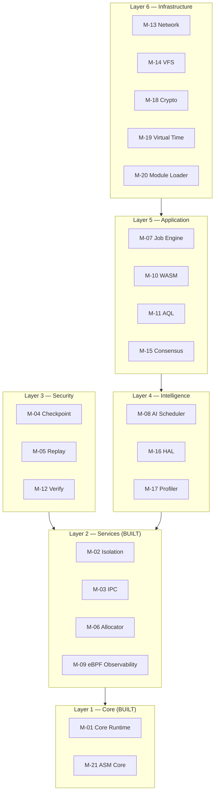
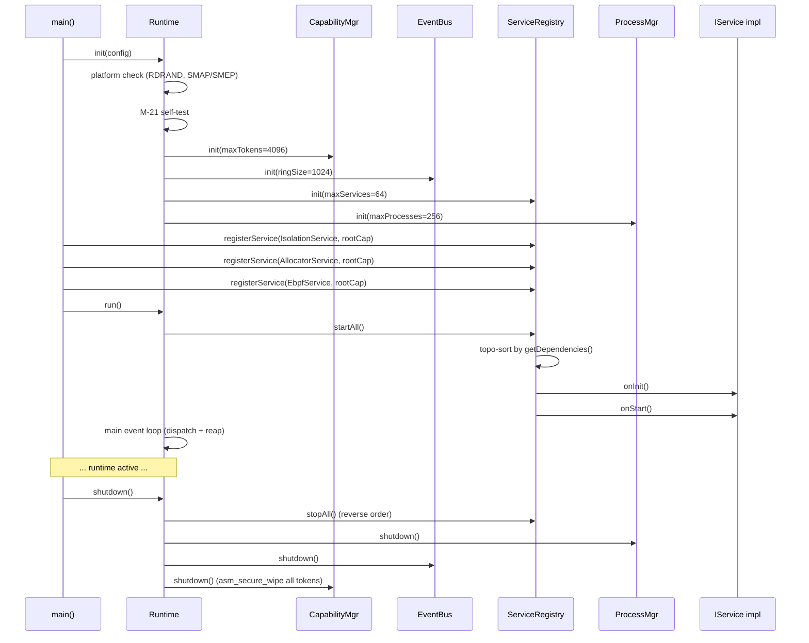
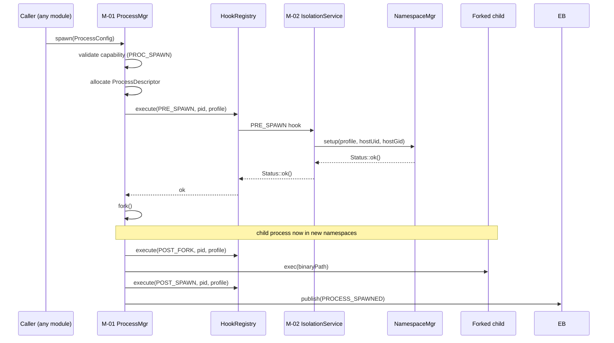
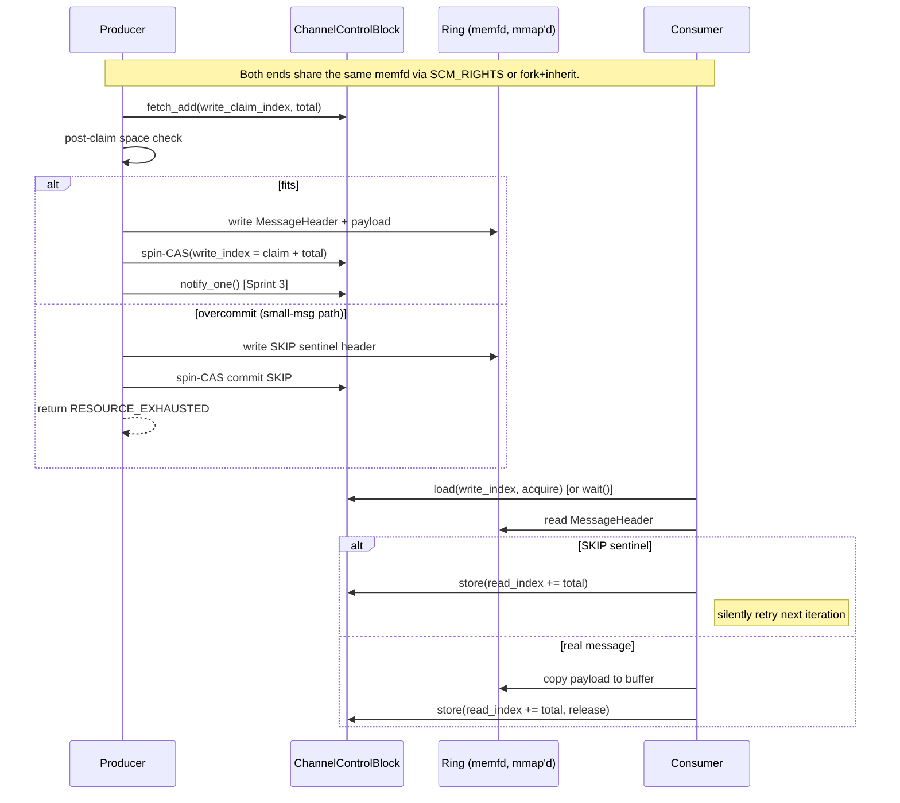
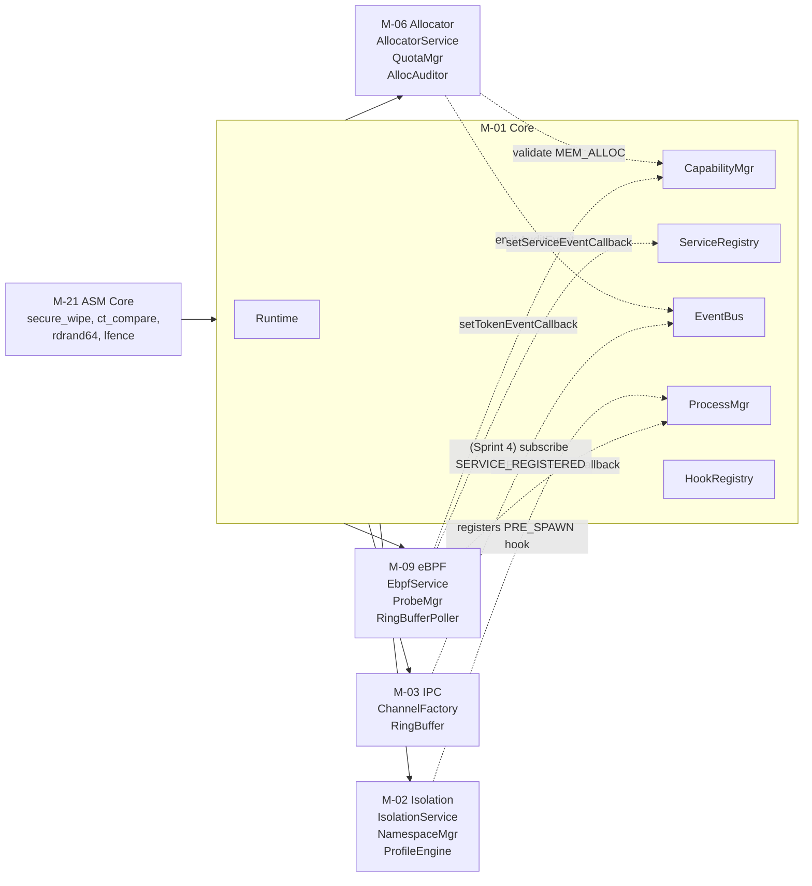
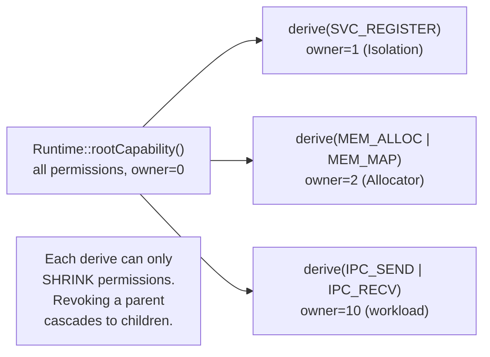
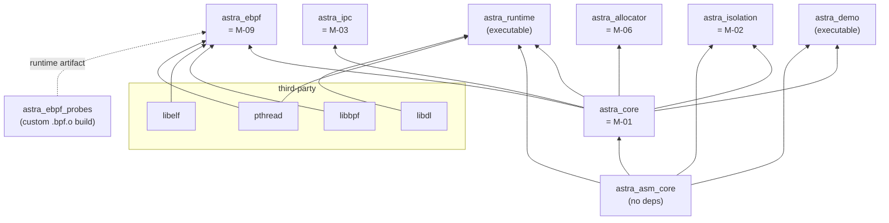

# Astra Runtime — Project Guide

A single end-to-end reference: what the project is, what each module
does and is built today, how the modules fit together at runtime, and
how the modules build together at compile time.

Last updated: 2026-04-26 (against `main` at commit `eac9600`).

---

## Table of contents

1. [What Astra is](#what-astra-is)
2. [Status snapshot](#status-snapshot)
3. [The 6-layer architecture](#the-6-layer-architecture)
4. [The 21-module catalog](#the-21-module-catalog)
5. [Runtime flow chart](#runtime-flow-chart)
6. [Module integration](#module-integration)
7. [Build system](#build-system)
8. [How to build the project](#how-to-build-the-project)
9. [Test inventory](#test-inventory)
10. [Conventions cheat sheet](#conventions-cheat-sheet)
11. [Where things live](#where-things-live)
12. [Recent history & what's next](#recent-history--whats-next)

---

## What Astra is

**Astra Runtime** is a userspace runtime that gates every zero-copy
memfd IPC channel on stock Linux through unforgeable capability
tokens with epoch-based cascading revocation, achieving
sub-microsecond validated message delivery without kernel
modifications. Built by KernelArch Labs, it is a *userspace kernel*
— a supervisor that runs above Linux and orchestrates sandboxed
processes without kernel patches.

The defensible technical claim is narrow and falsifiable:
**capability-mediated IPC can match raw shared-memory throughput
while supporting global O(1) revocation — a combination not
available in seL4 (no Linux), gVisor (no capabilities), or
Firecracker (no IPC model)**.

### What Astra actually has today (April 2026)

Of the five pillars previously claimed in the project pitch, **only
the first three are built**:

| Pillar | Status | Where |
|---|---|---|
| Capability tokens + zero-copy IPC | **Built** | `src/core/`, `src/ipc/` |
| Hardware-enforced namespace + tmpfs sandbox | **Built** | `src/isolation/` |
| Pool allocator + libbpf observability | **Built** (engineering plumbing) | `src/allocator/`, `src/ebpf/` |
| Deterministic forensic replay | **Reserved** | `src/checkpoint/`, `src/replay/` empty |
| AI-driven anomaly detection | **Reserved** | `src/ai/` empty |
| Formal verification of capability model | **Reserved** | `formal/coq`, `formal/tlaplus`, `formal/cbmc` all empty |

The empty rows are listed as *future work* in the README and in the
[Publication Strategy](PUBLICATION_STRATEGY.md). Reviewers and
contributors should treat any feature claim that isn't anchored to a
"Built" row as planning-language rather than a capability of the
current artifact. This is a deliberate honesty stance: we'd rather
under-claim publicly than be caught by a reviewer who clones the repo.

### Defence in depth (planned)

The project's eventual seven-layer defence-in-depth model — namespace
isolation, seccomp-BPF filtering, capability-scoped permissions,
allocator hardening, CFI enforcement, cryptographic IPC integrity,
AI behavioural monitoring — is the long-term goal. Today three of
those seven layers operate (namespaces, capability gating on
allocations, basic allocator hardening). The rest are scoped in
[docs/PUBLICATION_STRATEGY.md](PUBLICATION_STRATEGY.md).

**Audiences**

- Security researchers and students learning memory safety in C++
- Incident response teams needing byte-for-byte deterministic replay
- CTF platforms, CI/CD sandboxes, research workloads
- Performance-sensitive secure workloads (target: sub-200 ns IPC with
  HMAC-SHA256 at <50 ns overhead)

**Target codebase**: 80k–150k LOC across 21 modules, ~15–20% of which is
security infrastructure.

---

## Status snapshot

As of April 2026 (this guide's commit):

| Layer | Module | Status | Sprint |
|---|---|---|---|
| 1 | M-01 Core Runtime | **BUILT** | Phase 2 (hooks, dependency graph, real fork/exec) |
| 1 | M-21 ASM Core | **BUILT** | C++ stubs in place; NASM ports pending |
| 2 | M-02 Isolation | **BUILT** | Sprint 1 (USER + PID NS) and Sprint 2 (MOUNT NS + pivot_root) |
| 2 | M-03 IPC | **BUILT** | Sprint 1 (channel factory), Sprint 2 (ring buffer + MPSC), Sprint 3 (wait/notify) |
| 2 | M-06 Allocator | **BUILT** | Sprints 1–3 (pools, hardening, capability gating) |
| 2 | M-09 eBPF Observability | **BUILT** | Sprint 1 (probe loader + ring-buffer poller, single `task_spawn` USDT probe) |
| 3 | M-04 Checkpoint | STUB | directory placeholder, no code |
| 3 | M-05 Replay | STUB | directory placeholder |
| 3 | M-12 Verify | STUB | directory placeholder |
| 4 | M-08 AI Scheduler | STUB | directory placeholder |
| 4 | M-16 HAL | STUB | directory placeholder |
| 4 | M-17 Profiler | STUB | directory placeholder |
| 5 | M-07 Job Engine | STUB | directory placeholder |
| 5 | M-10 WASM | STUB | directory placeholder |
| 5 | M-11 AQL | STUB | directory placeholder |
| 5 | M-15 Consensus | STUB | directory placeholder |
| 6 | M-13 Network | STUB | directory placeholder |
| 6 | M-14 VFS | STUB | directory placeholder |
| 6 | M-18 Crypto | STUB | directory placeholder |
| 6 | M-19 Virtual Time | STUB | directory placeholder |
| 6 | M-20 Module Loader | STUB | directory placeholder |

Six modules are real and tested. Fifteen are scaffolding (a directory
under `src/` plus a `.gitkeep`) waiting for the corresponding phase.

---

## The 6-layer architecture

Each layer is a security boundary. A breach must clear all six to
compromise a sandboxed task.



**Why M-21 sits in Layer 1**: every higher layer depends on the
constant-time crypto and memory primitives in M-21 being correct. If
those primitives leak via timing, the whole stack is compromised.

**Why Layer 3 (Security) is its own layer**: C++ has no compile-time
memory safety. The runtime security layer compensates with intrusion
detection, CFI enforcement, and cryptographic integrity checks on every
cross-module call — the differentiator versus a Rust-based equivalent.

---

## The 21-module catalog

### Layer 1 — Core

#### M-01 Core Runtime — `astra::core` — BUILT

Central nervous system of the runtime. Lives in
[src/core/](../src/core/) and [include/astra/core/](../include/astra/core/).

What it provides:

- `Runtime` — the orchestrator. Owns `CapabilityManager`, `EventBus`,
  `ServiceRegistry`, `ProcessManager`. Public API in
  [include/astra/core/runtime.h](../include/astra/core/runtime.h).
- `IService` — the interface every module implements. Lifecycle:
  `onInit() → onStart() → onStop()`. Plus `name()`, `moduleId()`,
  `isHealthy()`, `getDependencies()`. See
  [include/astra/core/service.h](../include/astra/core/service.h).
- `ServiceRegistry` — pre-allocated table of up to 64 service slots,
  O(1) lookup by id, O(n) lookup by name or module id. Topologically
  sorts services by `getDependencies()` for `startAll()`.
- `CapabilityManager` — token pool of 4096 slots. Tokens are
  unforgeable 128-bit IDs carrying a `Permission` bitmask, an epoch,
  and an owner id. `validate()` is spinlock-free; only
  create/derive/revoke take a spinlock.
- `EventBus` — lock-free ring buffer of 1024 × 64-byte events. Up to
  64 subscribers. Fires events for runtime, service, process,
  capability, security and IPC categories.
- `ProcessManager` — pre-allocated table of process descriptors.
  Real `fork`/`exec` spawning in Phase 2. Reaps zombies. Owns the
  `HookRegistry` chain.
- `HookRegistry` — priority-ordered chains keyed on
  `HookPoint::{PRE_SPAWN, POST_FORK, POST_SPAWN, PRE_KILL, POST_EXIT}`.
  Each chain holds up to 16 hooks. M-02 registers a `PRE_SPAWN` hook
  to apply isolation before exec.

Tests: `Phase2UnitTest`, `Phase2IntegrationTest`.

#### M-21 ASM Core — `astra::asm_core` — BUILT (stubs)

Hand-written x86-64 assembly primitives, currently exposed via C++ stubs
at [src/asm_core/](../src/asm_core/). The ABI is the published target
even before NASM ports land:

- `secure_wipe(ptr, len)` — non-elidable memset to zero
- `ct_compare(a, b, len)` — constant-time memcmp
- `ct_select(cond, a, b)` — constant-time conditional select
- `rdrand64()` — hardware RNG
- `lfence()` — speculation barrier
- `cache_flush(ptr, len)` — `clflushopt` for cold-line testing
- `stack_canary_setup()` — install/check the per-thread canary

These are security-critical. Replacing the C++ stubs with real NASM is
a Phase-1 follow-up because the C++ versions are not guaranteed to be
constant-time under all optimisation levels.

### Layer 2 — Services

#### M-02 Isolation — `astra::isolation` — BUILT

Linux namespace + filesystem sandboxing. Lives in
[src/isolation/](../src/isolation/) and
[include/astra/isolation/](../include/astra/isolation/).

What it provides:

- `IsolationService` implementing `IService`. Registers a `PRE_SPAWN`
  hook into M-01's `ProcessManager` so namespaces are applied between
  fork and exec.
- `NamespaceManager` — owns the per-process namespace lifecycle. State
  machine: `INIT → USER_CREATED → MAPPED → PID_CREATED → MOUNT_CREATED
  → FS_PIVOTED → ACTIVE`. Each transition is atomic; `rollback()`
  unwinds whatever step failed.
- `ProfileEngine` — five sandbox profiles (PARANOID, STRICT, STANDARD,
  RELAXED, CUSTOM) each with a `NamespaceFlags` describing which
  namespaces to enable. Sealed after `init()`.

Sprint 1 added USER + PID namespaces (with deny-setgroups + uid_map /
gid_map writes). Sprint 2 added the MOUNT namespace, a tmpfs sandbox
root at `/tmp/astra_sandbox/<pid>`, RO bind mounts of `/usr/lib` and
`/usr/share`, and `pivot_root` with old-root unmount via `MNT_DETACH`.
The MS_PRIVATE propagation fix (commit `52b1c16`) is what makes
`pivot_root` work on systemd hosts.

Tests: `Sprint1NamespaceTest`, `Sprint2MountTest`.

#### M-03 IPC — `astra::ipc` — BUILT

Zero-copy interprocess communication. Lives in
[src/ipc/](../src/ipc/) and [include/astra/ipc/](../include/astra/ipc/).

What it provides:

- `Channel`, `UniqueFd`, `ChannelFactory` — Sprint 1. `memfd_create` +
  `mmap(MAP_SHARED)` to create a process-shareable region. Each
  channel carries a 3-cache-line `ChannelControlBlock` (write index,
  read index, metadata) followed by a power-of-two ring buffer
  (default 2 MiB).
- `RingBuffer` — Sprint 2. Framed messages with an 8-byte
  `MessageHeader` (`m_uPayloadBytes`, `m_uSequenceNo`). Two-phase
  MPSC claim/commit:
  - ≤ 256 B payloads: wait-free single `fetch_add` on
    `m_uWriteClaimIndex`.
  - > 256 B payloads: lock-free CAS retry loop.
  - Overcommit on the small-message path leaves a `SKIP` sentinel that
    `read()` silently consumes.
- Sprint 3 — `writeNotify()` / `readWait()` on top of
  `std::atomic::wait()` / `notify_one()`, which Linux backs with a
  futex. No busy-spin in the receiver.

Tests: `Sprint1IpcChannelFactoryTest`, `Sprint1IpcExtendedTest`,
`Sprint2IpcRingBufferTest`, `Sprint2IpcMpscTest`,
`Sprint3IpcWaitNotifyTest`. Plus an interactive `demo_ipc_live`.

Note: M-03 is currently a *primitive layer*, not yet wrapped in a
runtime-registered `IService`. Wrapping it in an `IpcService` that
auto-creates channels on `EventBus::SERVICE_REGISTERED` is the
intended Sprint 4.

#### M-06 Allocator — `astra::allocator` — BUILT

Pool-based, hardened memory manager. Lives in
[src/allocator/](../src/allocator/) and
[include/astra/allocator/](../include/astra/allocator/).

- `MemoryManager` — 4-tier pool routing (tiny / small / medium / large)
- `PoolAllocator` — slab-style fixed-size pools
- `QuotaManager` — per-`ModuleId` byte and object quotas
- `AllocAuditor` — emits `AuditEvent` records (`ALLOC`, `FREE`,
  `CAPABILITY_REJECT`, `QUOTA_REJECT`, `DOUBLE_FREE`, `CORRUPTION`)
- `AllocatorService` implementing `IService`. Public API
  `allocateFor(ModuleId, size, CapabilityToken&)` validates the
  `MEM_ALLOC` permission, then the quota, then routes to a pool.

Sprints: 1 (basic pools), 2 (poison patterns + double-free + canary
checks), 3 (per-module quotas + capability gating + audit hooks).
Tests: `AllocatorSprint1`, `AllocatorSprint2`, `AllocatorSprint3`.

#### M-09 eBPF Observability — `astra::ebpf` — BUILT

Kernel-side telemetry via libbpf + USDT probes. Lives in
[src/ebpf/](../src/ebpf/) and [include/astra/ebpf/](../include/astra/ebpf/).

- `EbpfService` implementing `IService`. `name() = "ebpf-observability"`,
  `moduleId() = ModuleId::EBPF`.
- `ProbeManager` — scans a probe directory at startup and loads every
  `.bpf.o` it finds via libbpf's `bpf_object__open`/`bpf_object__load`.
- `RingBufferPoller` — runs an `epoll_wait`-driven thread that drains
  the kernel ring buffer (`BPF_MAP_TYPE_RINGBUF`, 256 KiB) and calls a
  user callback for each event.
- `task_spawn.bpf.c` — the one shipped probe. CO-RE USDT, attached
  via uprobe, captures task-spawn arguments.

Three sister tracepoint slots (`TASK_EXIT`, `SERVICE_EVENT`) are
declared in `tracepoint.h` but have no probe yet — that is Sprint 2.

Tests: `EbpfUnitTests`. Plus an interactive `demo_ebpf_live` that
serialises synthetic events through the same pipeline.

> **Note on PR #8**: A separate "ObservabilityService Phase 1" PR
> proposed five polling threads under a different namespace but
> claiming the same `ModuleId::EBPF`. That was rejected — see commit
> `eac9600` for the full rationale. The canonical M-09 service is
> `astra::ebpf::EbpfService`.

### Layers 3–6

All modules in these layers are scaffolding only — directories under
`src/` and `include/astra/` with a `.gitkeep` placeholder. Their
`add_subdirectory(...)` lines in the root `CMakeLists.txt` are
commented out. The `ModuleId` enum reserves a slot for each so the
identifier space is stable while the implementations land.

| Module | Phase | Intended responsibility |
|---|---|---|
| M-04 Checkpoint | 5 | CRIU-style snapshots without kernel patches |
| M-05 Replay | 5 | Deterministic byte-for-byte replay of a checkpointed process |
| M-07 Job Engine | 3 | Cgroup-backed job scheduling and accounting |
| M-08 AI Scheduler | 6 | Anomaly detection, learned allocator, smart checkpoint timing |
| M-10 WASM | 4 | wasmtime-based WASM sandbox as a peer to the namespace sandbox |
| M-11 AQL | 4 | Astra Query Language for runtime introspection |
| M-12 Verify | 9 | Formal-verification harness for the capability model |
| M-13 Network | 7 | Network namespace + virtual NIC + capability-gated socket API |
| M-14 VFS | 7 | Pluggable virtual filesystem with capability ACLs |
| M-15 Consensus | 8 | Raft for distributed Astra clusters |
| M-16 HAL | 3 | Hardware abstraction (CPU feature detection, PMU access) |
| M-17 Profiler | 6 | Statistical profiling with M-08 feedback |
| M-18 Crypto | 7 | Ed25519 signatures, HMAC-SHA256, AES-GCM (built on M-21) |
| M-19 Virtual Time | 5 | Determinism for replay (logical clock) |
| M-20 Module Loader | 8 | Signed dynamic module loading |

---

## Runtime flow chart

### Boot sequence



### Process spawn — the M-01 ↔ M-02 hot path

This is the single most important integration in the runtime. It shows
how the isolation hook is called between `fork` and `exec`.



Important detail: M-02's hook runs *before* `fork`, so when the child
is forked it inherits whatever namespaces the parent is currently in.
Inside the child, the actual `unshare(CLONE_NEW*)` and `pivot_root`
are issued from `NamespaceManager::setup()` which is called inside
the child after fork. (Sprint 2 details in
[src/isolation/namespace_manager.cpp](../src/isolation/namespace_manager.cpp).)

### IPC data flow — the M-03 ring buffer



### Module integration map

How every built module talks to the others.



---

## Module integration

### How a module wires itself in

Every service follows the same six-step pattern. The
[`IsolationService`](../src/isolation/isolation_service.cpp) is the
canonical reference; `EbpfService` and `AllocatorService` follow the
same shape.

1. **Inherit `core::IService`** and implement the six pure-virtual
   methods: `name()`, `moduleId()`, `onInit()`, `onStart()`, `onStop()`,
   `isHealthy()`. Override `getDependencies()` if the module needs
   another module to start first.

2. **Take `core::Runtime&` in the constructor**. That gives access to
   `runtime.capabilities()`, `.services()`, `.events()`, `.processes()`.

3. **Initialise sub-objects in `onInit()`**. Allocate buffers, scan
   probe directories, seal profiles. No threads yet.

4. **Spawn threads / register hooks in `onStart()`**. This is where the
   service becomes active. Examples:
   - Isolation: `runtime.processes().setIsolationHook(...)`
   - eBPF: launches the `RingBufferPoller` thread
   - Allocator: opens the audit log

5. **Tear down in `onStop()`** — reverse order of `onStart()`. Stop
   threads, unregister hooks, close fds. Idempotent.

6. **Register in `main.cpp`**:

   ```cpp
   astra::isolation::IsolationService lIsolation(lRuntime);
   auto lTok = lRuntime.capabilities().derive(
       lRuntime.rootCapability(),
       Permission::SVC_REGISTER, /*ownerId=*/1);
   lRuntime.services().registerService(&lIsolation, lTok.value());
   // ... register other services ...
   lRuntime.run();   // calls startAll() under the hood
   ```

Two anti-patterns to avoid (both seen and rejected during PR review):

- **Don't `new` the service**: registry takes a non-owning raw pointer.
  Stack-allocate or own through a `unique_ptr` in `main`.
- **Don't ignore the registration `Result`**: it returns
  `Result<ServiceHandle>`; check `has_value()` before proceeding.

### How modules talk at runtime

Cross-module communication uses three mechanisms, in order of preference:

1. **Direct accessor on `Runtime`** for "give me the singleton manager".
   Example: `runtime.capabilities().validate(token, Permission::IPC_SEND)`.
2. **Hook chains** for lifecycle interception. Example: M-02 registering
   a `PRE_SPAWN` hook to enable namespaces before exec.
3. **`EventBus::publish`** + `subscribe` for decoupled fan-out. Example:
   M-09 subscribing to `SERVICE_REGISTERED` events for telemetry.

The cardinal rule: **never call across modules through anything other
than these three paths.** No file-scoped globals, no friend classes
across module boundaries, no exceptions thrown across module
boundaries.

### The capability flow



Permissions monotonically shrink down the tree. Revoking any token
revokes all its descendants — implemented by bumping the epoch and
checking it in `validate()`.

---

## Build system

### Active vs stubbed modules

Astra's root [`CMakeLists.txt`](../CMakeLists.txt) controls which
modules participate in the build:

```cmake
add_subdirectory(src/asm_core)            # M-21: ACTIVE
add_subdirectory(src/core)                # M-01: ACTIVE
add_subdirectory(src/isolation)           # M-02: ACTIVE
add_subdirectory(src/ipc)                 # M-03: ACTIVE
add_subdirectory(src/allocator)           # M-06: ACTIVE
add_subdirectory(src/ebpf)                # M-09: ACTIVE

# add_subdirectory(src/checkpoint)        # M-04: planned
# add_subdirectory(src/replay)            # M-05: planned
# add_subdirectory(src/jobengine)         # M-07: planned
# add_subdirectory(src/ai)                # M-08: planned
# add_subdirectory(src/wasm)              # M-10: planned
# add_subdirectory(src/aql)               # M-11: planned
# add_subdirectory(src/verify)            # M-12: planned
# add_subdirectory(src/net)               # M-13: planned
# add_subdirectory(src/vfs)               # M-14: planned
# add_subdirectory(src/consensus)         # M-15: planned
# add_subdirectory(src/hal)               # M-16: planned
# add_subdirectory(src/profiler)          # M-17: planned
# add_subdirectory(src/crypto)            # M-18: planned
# add_subdirectory(src/vtime)             # M-19: planned
# add_subdirectory(src/loader)            # M-20: planned
```

Adding a new module's first sprint means uncommenting that line and
populating its `src/<module>/CMakeLists.txt` to declare the
`astra_<module>` static library.

### Build dependency graph



The graph is a strict DAG — no circular dependencies. Build order
falls out of CMake automatically from `target_link_libraries`. The
practical order is:

1. `astra_asm_core` (no upstream deps)
2. `astra_core` (depends on `astra_asm_core`)
3. `astra_isolation`, `astra_ipc`, `astra_allocator`, `astra_ebpf` (all
   depend on `astra_core`; built in parallel)
4. `astra_ebpf_probes` (custom command running `clang -target bpf` on
   `.bpf.c` files, output under `build/probes/`)
5. Test executables, then the runtime / demo binaries

### Build flags applied globally

From [CMakeLists.txt](../CMakeLists.txt):

```
C++ standard:  -std=c++23 (mandatory; build fails on older)
Warnings:      -Wall -Wextra -Werror -Wpedantic -Wshadow
               -Wconversion -Wsign-conversion -Wold-style-cast
Hardening:     -fstack-protector-strong -D_FORTIFY_SOURCE=2 -fPIE
               -Wl,-z,relro -Wl,-z,now -Wl,-z,noexecstack
Optional:      ASTRA_ENABLE_SANITIZERS=ON adds -fsanitize=address,undefined
Platform:      Linux x86-64 only. CMakeLists.txt:24 rejects every
               other OS (verified on macOS Darwin).
```

These flags are non-negotiable. New code that breaks `-Werror` is
treated as a build break.

### Adding a module to the build

Concrete checklist for moving a module from STUB to BUILT:

1. Create `include/astra/<module>/<service>.h` declaring the
   `IService` subclass.
2. Create `src/<module>/<service>.cpp` with the implementation.
3. Create `src/<module>/CMakeLists.txt`:

   ```cmake
   add_library(astra_<module> STATIC
       <service>.cpp
   )
   target_include_directories(astra_<module> PUBLIC
       ${CMAKE_SOURCE_DIR}/include
   )
   target_link_libraries(astra_<module>
       PUBLIC astra_core
       PRIVATE pthread
   )
   message(STATUS "  [M-XX] astra_<module> library configured")
   ```

4. Uncomment the corresponding `add_subdirectory(src/<module>)` line in
   the root `CMakeLists.txt`.
5. Add to the runtime executable's link list if the runtime should
   register your service automatically.
6. Create `tests/<module>/CMakeLists.txt` with at least one
   `add_executable` + `add_test` registration.
7. Uncomment `add_subdirectory(tests/<module>)` in the root.

That's the entire onboarding path. M-02, M-03, M-06 and M-09 all
follow this exact shape — copy any of them as a starting template.

---

## How to build the project

### Prerequisites (Fedora / Ubuntu / Arch)

- Linux x86-64 (the build refuses every other host)
- GCC 13+ or Clang 17+ (project uses `-std=c++23`)
- CMake 3.28+
- NASM 2.16+ (for M-21 once NASM ports land)
- libbpf-dev, libelf-dev, clang (for M-09 eBPF probes)
- pthread, libdl

Fedora:

```
sudo dnf install -y gcc-c++ cmake nasm libbpf-devel elfutils-libelf-devel clang
```

### One-shot build + test

The repo ships [`scripts/compile-astra.sh`](../scripts/compile-astra.sh)
for the standard build + test cycle. Either invoke it directly:

```
./scripts/compile-astra.sh                  # full build + ctest
./scripts/compile-astra.sh -R Sprint2       # filter ctest by regex
ASTRA_BUILD_TYPE=Release ./scripts/compile-astra.sh
ASTRA_JOBS=4 ./scripts/compile-astra.sh     # override parallelism
```

…or alias it:

```
alias compile-astra='~/projects/Astra/scripts/compile-astra.sh'
```

### What the script does, expanded

```
cmake -S . -B build -DCMAKE_BUILD_TYPE=Debug
cmake --build build -j"$(nproc)"
ctest --test-dir build --output-on-failure
```

1. **Configure** — CMake scans `CMakeLists.txt`, evaluates active
   modules, generates `build/Makefile`s.
2. **Build** — Make compiles every `astra_*` library in dependency
   order, then links each test executable.
3. **Test** — CTest runs every executable registered with `add_test()`.

The expected pass count today is **9 tests**:
`Sprint1NamespaceTest`, `Sprint2MountTest`,
`AllocatorSprint1`, `AllocatorSprint2`, `AllocatorSprint3`,
`Sprint1IpcChannelFactoryTest`, `Sprint1IpcExtendedTest`,
`Sprint2IpcRingBufferTest`, `Sprint2IpcMpscTest`,
`Sprint3IpcWaitNotifyTest`, `EbpfUnitTests`, plus the two Phase-2
core tests (`Phase2UnitTest`, `Phase2IntegrationTest`).

### Common runtime requirements

Some tests require kernel features:

- **M-02 isolation tests** need user-namespace cloning enabled:

  ```
  sudo sysctl kernel.unprivileged_userns_clone=1
  ```

  Or run the test under `sudo` if the sysctl is locked at 0.

- **M-09 eBPF tests** ship as struct-layout tests (no kernel needed).
  Real probe attachment in Sprint 2 will require `CAP_BPF` /
  `CAP_PERFMON` or root.

### Build presets

[CMakePresets.json](../CMakePresets.json) defines named configurations.
Defaults are `Debug` (with sanitizers off) and `Release` (full
optimisation). Use `cmake --preset <name>` instead of the raw
`-DCMAKE_BUILD_TYPE=...` if you prefer.

---

## Test inventory

Every test currently registered with CTest:

| ID | Module | Executable | What it verifies |
|---|---|---|---|
| 1 | M-01 | `test_phase2_unit` | HookRegistry, dependency graph, descriptor lifecycle |
| 2 | M-01 | `test_phase2_integration` | Real fork/exec + signal delivery + reaping |
| 3 | M-02 | `test_sprint1` | USER + PID namespace setup, deny-setgroups, uid_map |
| 4 | M-02 | `test_sprint2` | MOUNT NS + tmpfs sandbox + RO bind mounts + pivot_root |
| 5 | M-03 | `test_ipc_sprint1` | `memfd_create` + `mmap(MAP_SHARED)` channel allocation |
| 6 | M-03 | `test_ipc_sprint1_extended` | SCM_RIGHTS handoff with real Astra payloads |
| 7 | M-03 | `test_ipc_sprint2` | Ring buffer framing, FIFO ordering, wraparound |
| 8 | M-03 | `test_ipc_sprint2_mpsc` | wait-free / CAS paths, SKIP sentinel handling |
| 9 | M-03 | `test_ipc_sprint3` | Futex-backed `wait()` / `notify_one()` |
| 10 | M-06 | `test_allocator` | Pool routing, basic alloc/free |
| 11 | M-06 | `test_allocator_sprint2` | Poison patterns, double-free, canary corruption |
| 12 | M-06 | `test_allocator_sprint3` | Quota enforcement, capability rejection, audit emission |
| 13 | M-09 | `test_ebpf` | EbpfEventHeader layout, lifecycle guards, probe-dir validation |

Plus two interactive demos (`demo_ipc_live`, `demo_ebpf_live`) — built
but not run by CTest.

---

## Conventions cheat sheet

### Naming (Hungarian-style)

| Scope | Prefix | Example |
|---|---|---|
| Member field | `m_` | `m_iFd`, `m_eState`, `m_szName` |
| Local variable | `l` | `lIRetVal`, `lSzPath` |
| Function argument | `a` | `aProfile`, `aUHostUid`, `aSzName` |
| Global | `g_` | `g_logIpc` |

| Type | Letter | Example |
|---|---|---|
| `int` | `i` | `m_iFd` |
| `U32` / `U64` / `SizeT` | `u` | `m_uWriteIndex` |
| `bool` | `b` | `m_bInitialised` |
| enum | `e` | `m_eState` |
| pointer | `p` | `m_pControl` |
| `std::string` / `const char*` | `sz` | `m_szName` |
| `std::vector` | `v` | `m_vThreads` |
| file descriptor | `fd` | `m_fdUserNs` |

### Error handling

```cpp
Result<Channel> ChannelFactory::createChannel(...) const {
    if (aUChannelId == 0) {
        return std::unexpected(makeError(
            ErrorCode::INVALID_ARGUMENT,
            ErrorCategory::IPC,
            "Channel ID must be non-zero"));
    }
    // ...
    return Channel(...);
}

auto lResult = lFactory.createChannel(1, 4096, "demo");
if (!lResult.has_value()) {
    LOG_ERROR(g_logIpc, "{}", lResult.error().message());
    return;
}
Channel lCh = std::move(lResult.value());
```

No exceptions on hot paths. `Status = expected<void, Error>` for
functions that return only success/failure.

### Logging

```cpp
ASTRA_DEFINE_LOGGER(g_logEbpf);                      // in ONE .cpp
g_logEbpf.initialise("ebpf", "logs/ebpf.log",        // in onInit()
                     LogLevel::DEBUG, /*tee=*/true);
LOG_INFO(g_logEbpf, "Channel {} created", id);       // anywhere
```

The macros are `LOG_TRACE / DEBUG / INFO / WARN / ERROR / FATAL` plus
`LOG_SEC_ALERT` and `LOG_SEC_BREACH` (always emit, regardless of
filter level).

### File header banner

Every `.h` and `.cpp` opens with a banner like:

```cpp
// ============================================================================
// Astra Runtime - M-XX <Layer Name>
// <relative/path/to/file>
//
// One-paragraph "what this file does" / "Sprint X added Y".
// ============================================================================
```

This is enforced by review, not by tooling. Sprint history goes here
so a reader knows what was added when.

---

## Where things live

```
.
├── CMakeLists.txt                      # root build, module activation
├── CMakePresets.json                   # named build presets
├── README.md                           # short project intro
├── docs/
│   ├── PROJECT_GUIDE.md                # this file
│   ├── api/                            # generated API reference (TBD)
│   ├── architecture/                   # detailed architecture notes (TBD)
│   ├── module_specs/                   # per-module specifications (TBD)
│   ├── onboarding/                     # contributor onboarding (TBD)
│   ├── research/papers/                # paper drafts
│   └── security/{advisories,pentest,threat_models}/
├── include/astra/
│   ├── common/                         # types.h, result.h, log.h, version.h
│   ├── core/                           # M-01 public API
│   ├── isolation/                      # M-02 public API
│   ├── ipc/                            # M-03 public API
│   ├── allocator/                      # M-06 public API
│   ├── ebpf/                           # M-09 public API
│   └── <other modules>/                # placeholders
├── src/
│   ├── main.cpp                        # the runtime binary entry point
│   ├── demo_main.cpp                   # the demo binary entry point
│   ├── asm_core/                       # M-21
│   ├── core/                           # M-01
│   ├── isolation/                      # M-02
│   ├── ipc/                            # M-03
│   ├── allocator/                      # M-06
│   ├── ebpf/                           # M-09 (incl. probes/*.bpf.c)
│   └── <other modules>/                # stubs
├── tests/                              # mirrors src/ layout
├── scripts/
│   └── compile-astra.sh                # build + test driver
├── benchmarks/                         # perf harnesses (planned)
├── tools/                              # CLI helpers (planned)
├── third_party/                        # vendored deps if any
└── build/                              # gitignored CMake output
```

---

## Recent history & what's next

### What landed in the last six weeks

```
eac9600  docs: PR #8 (M-09 ObservabilityService Phase 1) rejected
1ae347c  fix(M-03): correct drain-count invariant in Sprint2 SKIP test
32bd8fd  fix(M-03): make IPC test structs build under Clang 21 -Werror
4a590d1  chore: add scripts/compile-astra.sh
d0475ee  Merge PR #9 (M-03 IPC Sprint 2 + 3: Ring Buffer + wait/notify)
56d5a01  Merge PR #7 (M-02 Sprint 2: MOUNT namespace + filesystem pivot)
...
ccde706  Merge IPC Sprint 1 (Branch-Laakhi)
79d7f80  feat(ebpf): implement M-09 eBPF Observability microservice
```

### Next obvious work, by module

**M-03 IPC**
- Wrap the channel/ring primitives in an `IpcService` that subscribes
  to `EventBus::SERVICE_REGISTERED` and auto-creates inter-service
  channels.
- HMAC integrity (Sprint 4): every message carries an HMAC-SHA256
  computed via M-21 primitives, verified on receive.
- Replay guard (Sprint 8): per-message sequence numbers verified
  globally, not just per-producer (today's `m_uNextSeq` is per-instance).

**M-09 eBPF**
- Implement the placeholder `TASK_EXIT` and `SERVICE_EVENT`
  tracepoints declared in `tracepoint.h`.
- Route ring-buffer events into a structured telemetry sink instead
  of stdout.
- Add integration tests that load a real probe (gated on `CAP_BPF`).

**M-21 ASM Core**
- Replace the C++ stubs with NASM `.asm` files. Add timing tests
  ensuring `ct_compare` is genuinely constant-time.

**M-02 Isolation**
- Mount `/proc` inside the sandbox so PID 1 can read its own state.
- Add a seccomp profile per `ProfileType`.
- Wire cgroup creation (memory/CPU limits per profile).

**M-06 Allocator**
- Hook M-09 `setProcessEventCallback` to attribute allocations to
  process owners.

**Phase 3 starts (M-07 Job Engine, M-16 HAL)** once the four built
service modules clear a security audit and pen test.

---

*This document is the canonical entry point for new contributors.
When something here disagrees with the code, the code wins — please
update this guide in the same PR that changes the underlying behaviour.*
